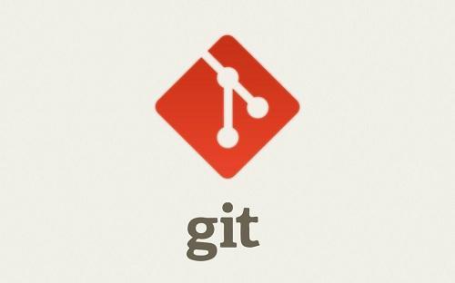
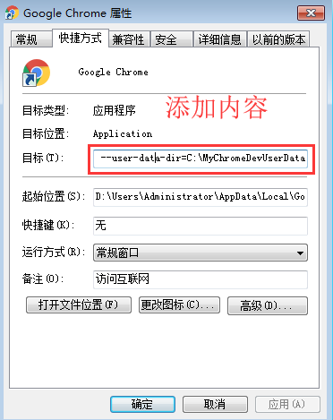

# 一.开发工具

::: tip 前言
了解一些项目中常见的前端工具，能显著提高工作效率
:::

## 1.Node.js

- 1.[官网下载 Node.js](http://nodejs.cn)（以 windows 系统 64 位为例）

  

- 2.安装 Node.js

  

- 3.cmd 中查看 node 版本，校验是否安装成功

```sh
node -v
```

## 2.Git



### 2.1 安装 Git

- [Git 官网](https://git-scm.com)下载 git 进行安装
- [git 使用教程]()

### 2.2 安装 TortoiseGit


- [TortoiseGit 官网](https://tortoisegit.org/download/)下载 TortoiseGit 进行安装
- [TortoiseGit 使用教程]()

### 2.3 VScode 中安装`Git History`插件

-

## 3.Visual Studio Code

- [安装 Visual Studio Code](https://code.visualstudio.com)

  
- 安装相关插件
- 相关配置

## 4.Chrome

- 安装 Chrome
- Chrome 跨域，方便本地开发解决跨域问题(--user- data- dir=C:\MyChromeDevUserData)

  
  
- Chrome 浏览器调试技巧
- [安装 DevTools](https://github.com/vuejs/devtools)，方便调试 vue 代码
- [安装 Vue performance Devtool](https://github.com/vuejs/devtools)，方便查看 vue 代码性能

## 5.Postman

- 安装 Postman

  

## 6.npm

- npm
- cnpm
- pnpm
