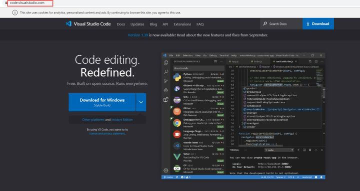
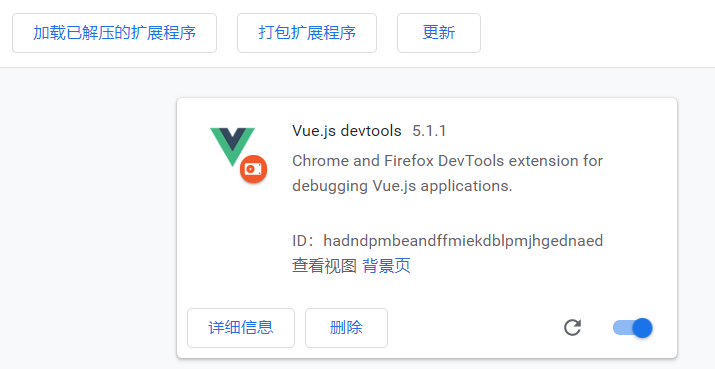

# 一.开发工具

## 1.Node.js

- [Node.js 官网](http://nodejs.cn)下载 node 进行安装

## 2.Git

### 2.1 安装 Git

- [Git 官网](https://git-scm.com)下载 git 进行安装
- [git使用教程]()

### 2.2 安装 TortoiseGit

- [TortoiseGit 官网](https://tortoisegit.org/download/)下载 TortoiseGit 进行安装
- [TortoiseGit 使用教程]()
## 3.Visual Studio Code

### 3.1 安装 Visual Studio Code

### 3.2 配置相关插件

## 4.Chrome

### 4.1 安装 Chrome

- Chrome 跨域

### 4.2 安装 DevTools

[下载地址](https://github.com/vuejs/devtools)

### 4.3 Vue performance Devtool

## 5.Postman

- 安装 Postman

## 6.npm

- 升级 npm

### 6.1 npm 包管理器
