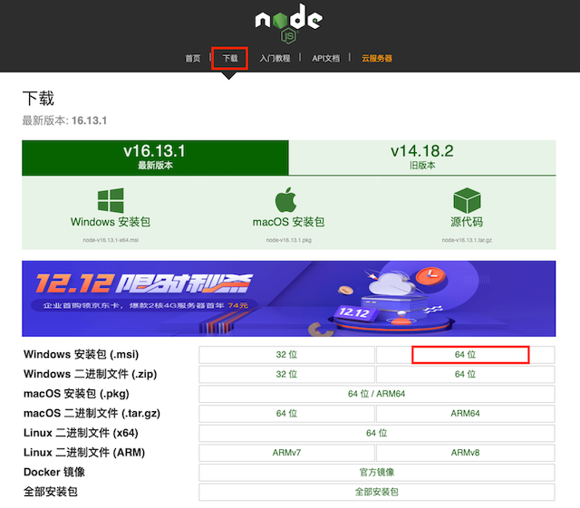
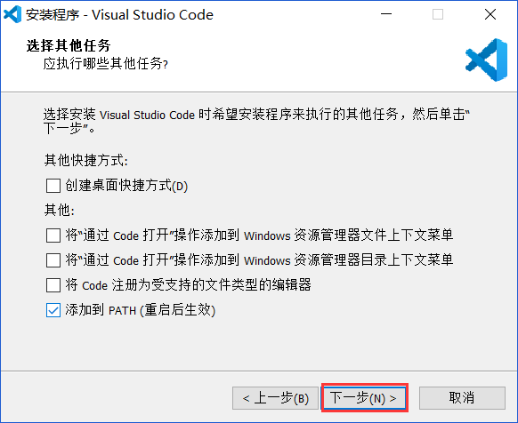
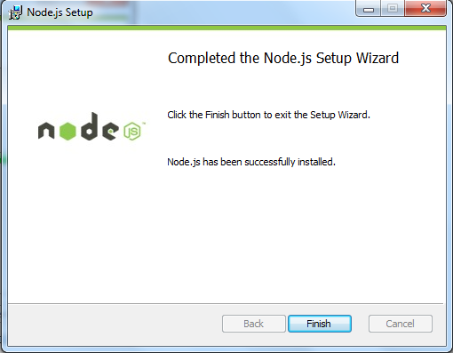
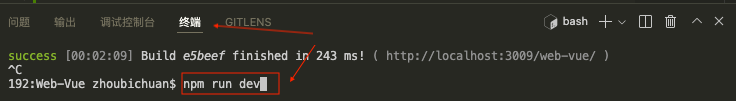

# 初始化（开发工具）

::: tip 前言
了解前端项目开发中环境的相关配置，工具的相关使用技巧等，有助于快速解决开发时遇到的各种问题，提高开发效率
:::

## 1.Node.js

::: warning 注意
实际开发中团队中 node 版本最好保持一致，包括各种环境（dev、sit、uat、生产）中
:::

- 1.[官网下载 Node.js](http://nodejs.cn)（以 windows 系统 64 位为例）

  

- 2.安装 Node.js（注意有时有问题需要注意环境变量的配置）

- 3.cmd 中查看 node 版本，校验安装成功后，升级 npm

  ```sh
  node -v
  npm install -g npm@latest # npm i npm -g
  ```

## 2.版本控制

::: warning 注意
目前推荐使用`Git`及相关插件，不推荐 `SVN` 管理代码，但是推荐管理相关技术文档资料
:::

- 版本规范 挑选稳定版本 记录版本号 如果版本升级，需要总结版本差异

### 2.1 安装 Git

- [Git 官网](https://git-scm.com)下载 git 进行安装
- 常用命令
  - 代码合并提交
  - 创建分支、切分支
  - 临时存储

::: details 苹果系统中使用 homebrew 安装 git

- 安装 homebrew

```sh
  /bin/zsh -c "$(curl -fsSL https://gitee.com/cunkai/HomebrewCN/raw/master/Homebrew.sh)"
```

:::

## 3.编辑器

::: warning 注意
不推荐使用 hbuilder、sublime text、WebStorm、Atom，推荐使用`Visual Studio Code`，重点关注一些常见的功能（终端、代码对比、批量替换、代码调试）
:::

### 3.1 安装配置 vscode

- 1.官网下载：[https://code.visualstudio.com](https://code.visualstudio.com)
- 2.安装时勾选选项后，不需要拖动`代码文件`、或`项目目录`到编辑器，就可以直接用鼠标右键打开目标

  

- 3.使用自带的终端 + bash 运行命令

  

  建议使用 vscode 自带的终端，快捷键`ctl`+`～`,右边下角操作完成后可以直接运行命令（同 cmd 上操作）

  

- 4.安装插件
`.vscode/extensions.json`

```json
{
    "recommendations": [
          "baoxin.vscode-css-peek-bx",
          "dbaeumer.vscode-eslint",
          "donjayamanne.githistory",
          "eamodio.gitlens",
          "ecmel.vscode-html-css",
          "esbenp.prettier-vscode",
          "formulahendry.code-runner",
          "jasonnutter.search-node-modules",
          "jonnyyu.chrome-app-devtools",
          "kisstkondoros.vscode-gutter-preview",
          "mkxml.vscode-filesize",
          "ms-ceintl.vscode-language-pack-zh-hans",
          "octref.vetur",
          "oouo-diogo-perdigao.docthis",
          "palmpam.vue2-file-peek",
          "pranaygp.vscode-css-peek",
          "ritwickdey.liveserver",
          "tal7aouy.rainbow-bracket",
          "whtouche.vscode-js-console-utils",
          "xyz.local-history",
          "MS-CEINTL.vscode-language-pack-zh-hans",
          "PalmPam.vue2-file-peek",
          "ritwickdey.LiveServer"
    ]
  }
```

  - `Vue 2 Snippets`：Vue2 代码片段补全
  - `Document This`: 能够一键给代码中的类、函数加上注释，支持函数声明、函数表达式、箭头函数等
  - `Auto Close Tag`：自动添加 HTML / XML 关闭标签
  - `Auto Rename Tag`：自动重命名配对的 HTML / XML 标签
  - `Code Runner`：运行多种语言的代码片段或代码文件
  - `Chinese (Simplified) Language Pack for Visual Studio Code`：中文简体语言包
  - `Color Info`：提供你在 CSS 中使用颜色的相关信息
  - `CSS Peek`：使用此插件，你可以追踪至样式表中 CSS 类和 ids 定义的地方。当你在 HTML 文件中右键单击选择器时，选择“ Go to Definition 和 Peek definition ”选项，它便会给你发送样式设置的 CSS 代码
  - `Debugger for Chrome`：前端调试
  - `ESLint`：EsLint 可以帮助我们检查 Javascript 编程时的语法错误
  - `filesize`：在底部状态栏显示当前文件大小，点击后还可以看到详细创建、修改时间
  - `Git History`：以图表的形式查看 git 日志
  - `GitLens — Git supercharged`：显示文件最近的 commit 和作者，显示当前行 commit 信息
  - `HTML CSS Support`：html 代码自动补全以及 class 智能提示
  - `HTMLHint`：HTML 代码格式检测
  - `HTML Snippets`：代码自动填充
  - `Image Preview`：鼠标移到路径里显示图像预览
  - `JavaScript (ES6) code snippets`：es6 代码片段
  - `Live Server`：浏览器实时刷新
  - `Vetur`：Vue 语法高亮显示, 语法错误检查, 代码自动补全
  - `vscode-fileheader`：顶部注释模板，可定义作者、时间等信息，并会自动更新最后修改时间，快捷键: Ctrl+Alt+i (默认信息可在 文件 → 首选项 → 设置 中修改)

- 5.配置参数

  settins.json

  ```json
  {
    "editor.quickSuggestions": {
      //开启自动显示建议
      "other": true,
      "comments": true,
      "strings": true
    }, // vscode默认启用了根据文件类型自动设置tabsize的选项
    "editor.detectIndentation": false, // 重新设定tabsize
    "editor.tabSize": 2, // 每次保存的时候自动格式化
    "editor.formatOnSave": true, // 每次保存的时候将代码按eslint格式进行修复
    "eslint.autoFixOnSave": true, // 添加 vue 支持
    "eslint.validate": [
      "javascript",
      "javascriptreact",
      {
        "language": "html",
        "autoFix": true
      },
      {
        "language": "vue",
        "autoFix": true
      }
    ], // 让prettier使用eslint的代码格式进行校验
    "prettier.eslintIntegration": true, // 去掉代码结尾的分号
    "prettier.semi": false, // 使用单引号替代双引号
    "prettier.singleQuote": true, // 让函数(名)和后面的括号之间加个空格 // "javascript.format.insertSpaceBeforeFunctionParenthesis": false, // html格式化，这个按用户自身习惯选择
    "vetur.format.defaultFormatter.html": "js-beautify-html", // 让vue中的js按编辑器自带的ts格式进行格式化
    "vetur.format.defaultFormatter.js": "vscode-typescript",
    "vetur.format.defaultFormatterOptions": {
      "js-beautify-html": {
        "wrap_attributes": "force-aligned" // vue组件中html代码格式化样式
      }
    },
    "search.exclude": {
      "**/node_modules": true,
      "**/bower_components": true,
      "**/dist": true
    },
    "emmet.syntaxProfiles": {
      "javascript": "jsx",
      "vue": "html",
      "vue-html": "html"
    }, // 设置字体 // "editor.fontFamily": "'Droid Sans Mono', 'Courier New', monospace, 'Droid Sans Fallback'", // vscode 程序title位置显示内容，这里设置了显示路径
    "window.title": "${dirty}${activeEditorMedium}${separator}${rootName}", // 编辑器建议 显示在头部
    "editor.snippetSuggestions": "top",
    "editor.suggestSelection": "first",
    "vsintellicode.modify.editor.suggestSelection": "automaticallyOverrodeDefaultValue",
    "editor.codeActionsOnSave": {
      "source.fixAll.eslint": true
    },
    "beautify.ignore": "",
    "editor.fontSize": 20
  }
  ```

### 3.2 实用功能

- 代码对比

  - 右键需要比较的文件弹框选择`选择以进行比较`
  - 右键目标文件弹框选择`与已选项目进行比较`

    

### 3.3 批量替换

支持使用正则方式进行复杂场景的替换，对大型项目中批量修改非常高效

### 3.4 调试代码

可以直接在 vscode 中 debugger，更加直观感受整个代码运行流程

## 4.谷歌浏览器

- 跨域，方便本地开发解决跨域问题[参考资料](http://zhoubichuan.com/web-javascript/3.senior/7.cross/1.browser.html#_2-3-%E8%B0%B7%E6%AD%8C%E6%B5%8F%E8%A7%88%E5%99%A8)
- 相关调试技巧：developer tool
- 查看页面性能：LightHouse
- vue 代码调试插件：vue-devtools
- vue 页面性能测试插件：Vue performance Devtool

## 5.npm

::: warning 注意
推荐在 vscode bash 中运行相关命令

```bash
rm -rf node_modules #一些常见的命令操作需不能在cmd中执行，如删除依赖这个命令需要在bash中使用
```

:::

### 5.1 npm

- npm(node package manage)是 nodejs 自带的包管理工具。
- package.json

  - ~会匹配最近的小版本依赖包，比如~1.2.3 会匹配所有 1.2.x 版本，但是不包括 1.3.0
  - ^会匹配最新的大版本依赖包，比如^1.2.3 会匹配所有 1.x.x 的包，包括 1.3.0，但是不包括 2.0.0
  - \*这意味着安装最新版本的依赖包

- 常用命令

  ```sh
  npm init                # 生成package.json文件（需要手动配置）
  npm init -y             # 生成package.json文件（使用默认配置）
  npm i                   # 一键安装package.json下的依赖包
  npm i xxx               # 在项目中安装包名为xxx的依赖包（配置在dependences下）
  npm i xxx --save        # 在项目中安装包名为xxx的依赖包（配置在dependencies下）
  npm i xxx --save-dev    # 在项目中安装包名为xxx的依赖包（配置在devDependencies下）
  npm i -g xxx            # 全局安装包名为 xxx的依赖包
  npm run xxx             # 运行package.json中scripts下的命令
  npm update xxx          # 更新某个包
  npm home xxx            # 打开xxx包的主页
  npm repo xxx            # 打开xxx包的代码仓库
  npm publish             # 将当前模块发布到npmjs.com,需要先登录
  npm view xxx            # 查看当前依赖的版本
  npm view xxx version    # 查看当前依赖仓库的版本
  ```
- `.npmrc`
```sh
engine-strict=false
registry=https://mirrors.cloud.tencent.com/npm/
npmmirror:registry=registry https://registry.npmmirror.com/
```
### 5.2 cnpm

```sh
npm i --registry=https://registry.npm.taobao.org #可以在安装包的时候指定下载源
npm config set registry https://registry.npm.taobao.org #改变全局默认下载地址
npm install cnpm -g --registry=https://registry.npm.taobao.org
```

- cnpm 不受 package-lock.json 影响，只会根据 package.json 进行下载

### 5.3 yarn

- 有时候通过 cnpm 下载的包莫名不能用， 可以换用 yarn 解决这个问题

### 5.4 pnpm

- pnpm 速度快

::: tip 总结
熟悉常用的 vue 项目开发工具，以及常见的配置，保障项目的一致性
:::
