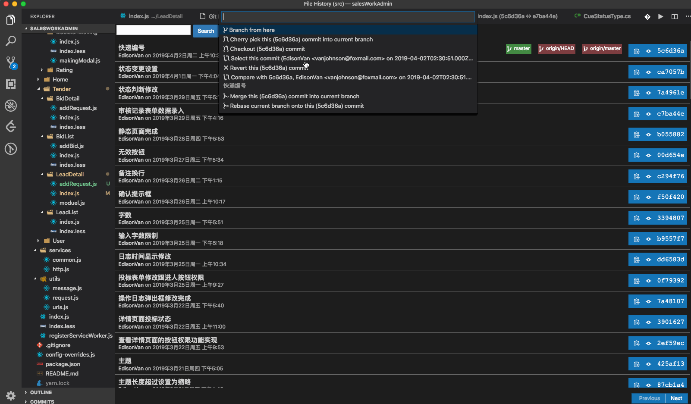
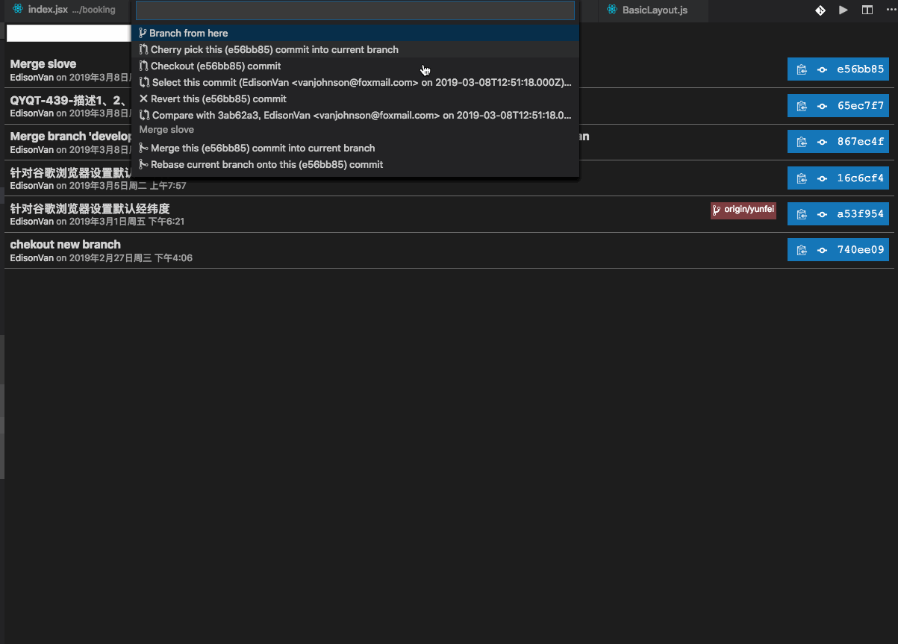
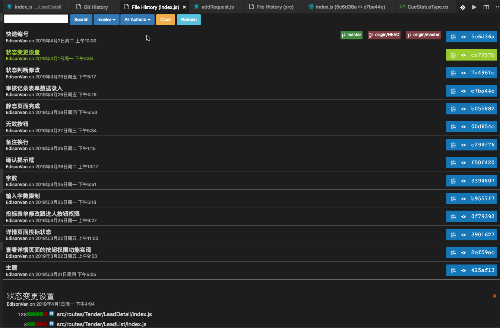

# 一.开发工具

::: tip 前言
了解一些项目中常见的前端工具，能显著提高工作效率
:::

## 1.Node.js

- 1.[官网下载 Node.js](http://nodejs.cn)（以 windows 系统 64 位为例）

  

- 2.安装 Node.js（注意有时使用有问题需要注意环境变量配置）

  

- 3.cmd 中查看 node 版本，校验是否安装成功

  ```sh
  node -v
  ```

## 2.Git

### 2.1 安装 Git

- [Git 官网](https://git-scm.com)下载 git 进行安装
- 常用命令
  - 代码合并提交
  - 创建分支、切分支

### 2.2 安装 TortoiseGit（新手推荐用这个替代命令行）

- [TortoiseGit 官网](https://tortoisegit.org/download/)下载 TortoiseGit 进行安装
- [TortoiseGit 使用教程]()

### 2.3 Git History（新手推荐用这个替代命令行）

- VsCode 上通过`扩展` 搜索 Git History 进行下载安装

- 使用

  - 1.选中文件-右键- Git:View File History
  - 2.F1 输入
    Git:View History(Git log) 查看所有分支的历史记录
    Git:View File History 查看文件的历史记录
    Git:View Line History 查看单行历史变更记录（不常用）

- 常用功能

  - 代码合并提交

  - 创建分支、切分支

  - 临时存储

  - 本地代码与当前版本代码对比

    <!--  -->

  - 当前版本号与上一个版本号对比

    <!--  -->

  - 不同版本号对比

    <!--  -->

  - 查看每一个作者的提交记录

    <!--  -->

  - 查看不同分支

    <!--  -->

## 3.Visual Studio Code

- [安装 Visual Studio Code](https://code.visualstudio.com)

  

- 代码对比

- 批量正则替换

## 4.Chrome

- 安装 Chrome
- Chrome 跨域，方便本地开发解决跨域问题(--user- data- dir=C:\MyChromeDevUserData)

  
  

- Chrome 浏览器调试技巧

## 5.npm

- npm
- cnpm
- yarn
- pnpm
