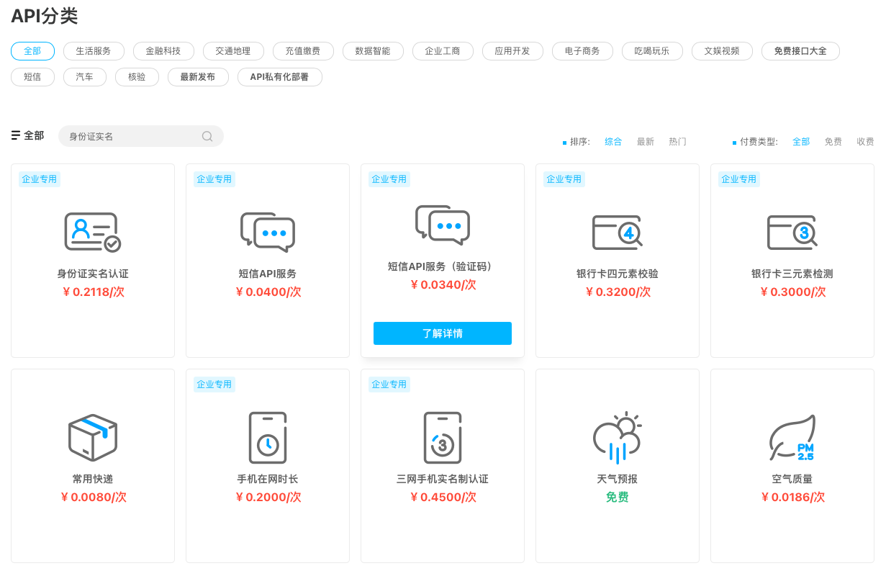

# 十一.Mock 数据

::: tip 前言
前后端同时开发的时候，后端接口数据没有出来，前端可以 mock 假数据，模拟开发，无需等待后的开发完成
:::

- 接口规范（成功，失败，状态码，安全） 和后端约定
- Postman 一款非常流行的 API 调试工具，通过工具可以更好地测试接口。安装后相关功能展示如下

  

## 1. 本地请求

在 public 下建立文件，/mock/user/login.json

```json
{
  "status": 0,
  "data": {
    "xxx": 123
  },
  "msg": "success"
}
```

App.vue：

```js
//本地加载请求静态json文件的形式
this.axios.get("/mock/user/login.json").then((res) => {
  this.res = res
})
```

## 2. 第三方平台

app.vue

```js
//使用easy-mock 网站做模拟接口，注意解决跨域问题
this.axios.get("/user/login").then((res) => {
  this.res = res
})
```

main.js:

```js
axios.defaults.baseURL = 'easy-mock 网站生成项目 mock 数据地址' //用未来实际地址替换
...
axios.get('/user/login').then( res => {})
```

## 3. webpack 方式

在 public 下建立文件，/mock/user/login.json

```json
{
  "status": 0,
  "data": {
    "xxx": 123
  },
  "msg": "success"
}
```

/mock/http.js

```js
module.export = function http(app) {
  app.get("/mock/user/login.json", (req, res) => {
    if(xxx){
      ....
      res.json({ data: "" })
    }
  })
}
```

vue.config.js

```js
const httpRequest = require('./mock/http')
...
devServer:{
  before(app) {
    httpRequest(app) // 调用 mock 函数
  }
}
...
```

App.vue：

```js
//本地加载请求静态json文件的形式
this.axios.get("/mock/user/login.json").then((res) => {
  this.res = res
})
```

## 4.第三方接口

### 1.1 聚合数据

> 聚合数据是国内领先的基础数据服务商， 以自有数据为基础，各种便捷服务整合以及第三方数据接入，为互联网开发全行业提供标准化 API 技术支撑服务的 DaaS 平台。

在官网 API 首页（[https://www.juhe.cn/docs](https://www.juhe.cn/docs)）我们可以选择你想要的接口类型进行调用


### 1.2 其他第三方接口

除了整合型的第三方接口聚合数据外，其他比较实用的第三方接口还有：

- [高德地图](https://lbs.amap.com/)：访问高德地图的 Web API
- [GitHub](https://developer.github.com/v3/)：世界上领先的软件开发平台
- [百度翻译](http://api.fanyi.baidu.com/api/trans/product/index)：支持多种语言之间的相互翻译
- [和风天气](https://www.heweather.com/documents/)：中国天气信息
- [阿凡达数据](https://www.avatardata.cn/Docs) ：提供中国可用的 API

### 1.3.实例

接下来，我们便可以在 Vue 项目中接入第三方接口来实现数据的交互。这里我们以接入聚合数据的`历史上的今天`接口为例。

首先我们来看一下该接口的请求详情：

```sh
请求地址：http://api.juheapi.com/japi/toh
请求参数：v=1.0&month=10&day=31&key=你的AppKey
请求方式：GET
```

上方详情中我们可以看到请求参数主要有 4 个，分别为：

- v：string 类型。版本，当前：1.0
- month：int 类型。月份，如：10
- day：int 类型。日，如：1
- key：string 类型。你的 AppKey

通过接口入参的说明我们可以知道唯一可以变的数据便是月份和日期，所以我们页面中得有选择**月日**的功能。

另外我们再来看一下该接口的出参示例：

```js
{
    "error_code": 0,
    "reason": "请求成功！",
    "result": [
        {
            "day": 1,
            "des": "1907年11月1日 电影导演吴永刚诞生 &emsp;&emsp;吴永刚，1907年11月1日生于江苏吴县。1932年后参加影片《三个摩登女性》、《母性之光》的拍摄工作。1934年在联华影片公司编导处女作《神女》，一举成名，...",
            "id": 9000,
            "lunar": "丁未年九月廿六",
            "month": 11,
            "pic": "",
            "title": "电影导演吴永刚诞生",
            "year": 1907
        },
    }
}
```

通过上方示例，我们可以获取**历史上的今天**的标题、详情、图片等，这些数据可以用于页面展示。

这样经过接口入参和出参的分析，我们可以使用 Vux 构建一个简单的页面

通过点击上图中“查看历史上的今天”按钮，便可以调用接口获取数据列表并渲染。主要代码如下：

```vue
<template>
  <div>
    <datetime-view
      v-model="value"
      ref="datetime"
      :format="format"
    ></datetime-view>
    <p class="info">选中值: {{ value }}</p>
    <div class="btn-padding">
      <x-button type="primary" @click.native="watchHistory"
        >查看历史上的今天</x-button
      >
    </div>
    <panel header="历史上的今天" :list="list" type="1"></panel>
  </div>
</template>
<script>
import { DatetimeView, XButton, Panel } from "vux"
import { getHistory } from "_ser/moduleB"

export default {
  data() {
    return {
      value: "10-31",
      format: "MM-DD",
      list: [],
    }
  },
  methods: {
    watchHistory() {
      let data = this.value.split("-")
      this.list = []
      getHistory({
        v: "1.0",
        month: data[0],
        day: data[1],
        key: "d6ceaf9be9f116ae45e7699845d87056",
      }).then((response) => {
        if (!response.error_code) {
          response.result.map((e) => {
            this.list.push({
              title: e.title,
              desc: e.des,
              src: e.pic,
            })
          })
        }
      })
    },
  },
  components: {
    DatetimeView,
    XButton,
    Panel,
  },
}
</script>
```

上方我们通过调用封装的 `getHistory` 接口名称进行数据的获取，在本地调用的过程中需要注意跨域的问题，可以配置 devServer 的 proxy 代理来解决：

```js
/* vue.config.js */
module.exports = {
  devServer: {
    proxy: {
      "/juheapi": {
        target: "http://api.juheapi.com/",
        changeOrigin: true,
        pathRewrite: { "^/juheapi": "" },
      },
    },
  },
}
```

这样我们便完成了使用第三方接口获取数据实现页面渲染的功能，为自己的应用填充了数据和功能。

::: tip 总结
了解 vue 项目创建过程以及其目录结构，在开发中需要注意的地方，能够更好地规范前端开发
:::
