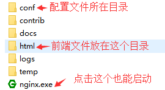

# 项目部署

::: tip 前言
前端开发也需要懂一些基本部署知识，确认已发布，测试是否成功发布本次项目代码
:::

- 打包项目代码得到前端项目的包文件目录，一般是`dist`文件目录

  ```sh
  npm run build
  ```

## 1.nginx 配置

- 前端代码一般是将打包后的文件放到 nginx 配置好的目录下面，通过 nginx 来部署的

- nginx 常见的配置

  ```sh
  # nginx/conf/nginx.conf
  ...
  location /[项目二级目录] {
    root D:/project/[项目名称]
    try_fiels $uri $uri/ /[打包目录]/index.html
    index index.html index.htm
  }
  ...
  ```

## 2.本地验证

::: warning 注意
有时候部署比较敏感，如紧急上 uat 环境，为了防止出意外导致投诉（如测试）或者确定前端代码部署质量排查部署产生的问题，可以先在本地安装 nginx 模拟线上环境，校验前端打包后的代码是否是正常的，自己确定修改无误后再部署
:::

- 1.windows 环境中 [下载 nginx](https://nginx.org/en/download.html)，然后在安装目录下解压

  

- 2.在 Nginx 的目录下使用 cmd 命令行，启动之后，打开 <http://localhost:80> 就能看的效果

  ```sh
  start nginx           # 启动
  ```

- 3.将前端打包目录放到指定位置，本地重启 nginx，验证打包代码（在安装根目录下启用 cmd）

  ```sh
  nginx -s reload       # 重启
  ```

- 常见命令

  ```sh
  start nginx           # 启动
  nginx -s stop         # 快速停止（不保存相关信息）
  nginx -s quit         # 有序停止（保存相关信息）
  nginx -s reload       # 重启（修改配置文件后用这个）
  ```

## 3.部署项目

本地代码检查没问题可以直接打包上线上测试环境

- **方式一**：直接上传本地打包后的代码到服务器（比较原始的方式）

  - 1.通过 ftp 远程连接`xshell`

    ```sh
    ssh root@[ip地址]
    然后输入密码 就成功连接上了
    ```

  - 2.将 dist 目录下的打包文件传输到服务器指定目录（服务器上需先启动 nginx）,重启 nginx

- **方式二**：vscode 安装 Remote-SSH 替代 xshell 传输
- **方式三**：通过相关工具部署流水线（genkins）
- **方式四**：通过相关工具部署流水线（gitlab）
- **方式五**："scp -r ./[前端打包目录]/* root@[ip地址]:[服务器项目目录地址]",

## 4.版本更新

::: warning 注意
有时候部署后需要查看代码是否更新，作出相关动作（提示用户刷新页面）
:::

- 在 public 下建立文件，/version.json（打包时 webpack 向此文件写入打包信息）

  ```json
  {
    "projectName": "xxx",
    "version": "xxx1.13",
    "date": "2021/12/19",
    "time": "123"
  }
  ```

- 刷新页面

  ```js
  // main.js
  setTimeout(() => {
    axios.get("/version.json").then((res) => {
      if (res.data.time !== localStorage.time) {
        localStorage.time = res.data.time
        message("项目有更新,10s后自动刷新页面")
      }
    })
  }, 10000)
  ```

::: warning 可能遇到的问题
linux 下有权限问题，如配置完成后访问出现 403,可以配置 SELINUX=disabled 解决
:::

::: tip 总结
通过对 vue 项目构建部署的了解，可以看到前端也需要学习一些构建部署知识，能在日常开发中轻松处理相关问题
:::
