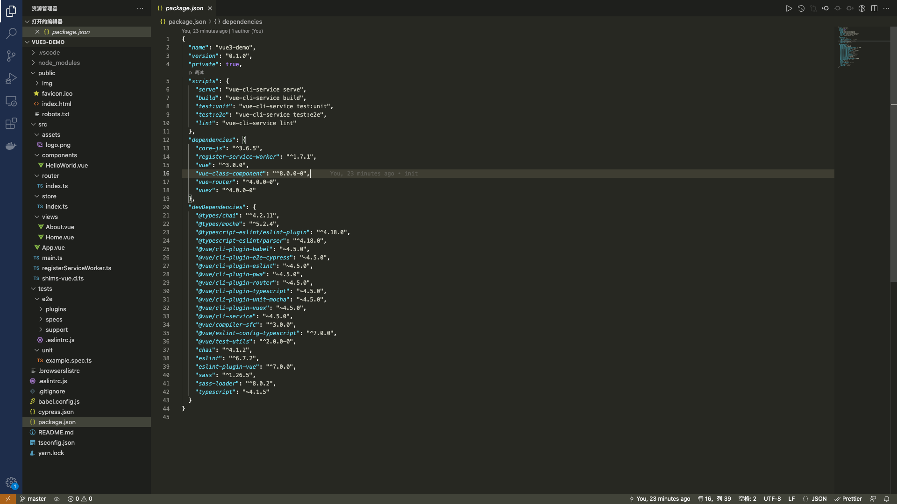
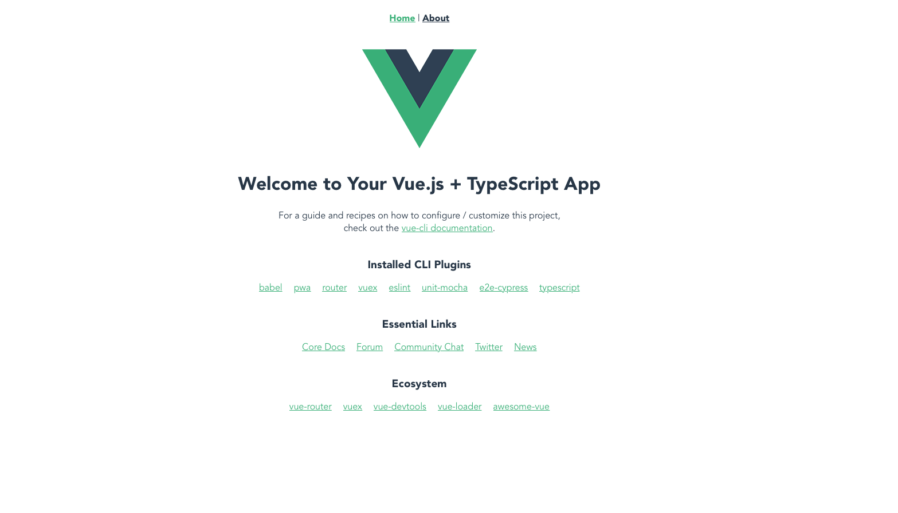

# 二.创建项目

::: tip 前言
了解 vue 项目创建过程以及其目录结构，在开发中需要注意的地方，能够更好地规范前端开发
:::

## 1.Vue 2.x 项目的搭建

### 1.1 安装`vue-cli`

```bash
npm install -g vue-cli
```

### 1.2 项目构建

```bash
vue init <template-name> <project-name>
npm i
npm run dev
# 使用旧版（2.X）创建
npm install -g @vue/cli-init
# 'vue init'的运行效果与‘vue-cli@2.x’相同
vue init webpack projectname
```

## 2.Vue 3.x 项目的搭建

### 2.1 安装 @vue/cli

:::warning 在安装 Vue-cli3.0 之前需要安装 node 和 npm
Vue-cli3.0 需要在 Node.js 8.9 或更高版本
:::

- 安装完毕，打开 cmd，通过查看 node 版本来判断是否安装成功

  ```bash
  node -v
  ```

- 在安装 node 的时候，npm 包管理器会自动安装，通过查看 npm 版本来判断是否安装成功

  ```bash
  npm -v
  ```

- 全局安装 Vue-cli 3.0

  ```bash
  npm i -g @vue/cli # 或者使用yarn安装 yarn install -g @vue/cli
  ```

### 2.2 通过 @vue/cli 创建项目

#### 2.2.1 通过图形界面创建项目

```bash
vue ui
```

#### 2.2.2 通过命令的方式创建项目

```bash
vue create vue3-demo
```

> - 选择模板
>
> ```bash {4}
> ? Please pick a preset:
>  Default ([Vue 2] babel, eslint)          # vue2.x最简配置
>  Default (Vue 3) ([Vue 3] babel, eslint)  # vue3.x最简配置
> ❯ Manually select features                 # 此处选择这个，用自定义配置
> ```
>
> - 选择那种包管理工具
>
> ```bash
> ❯ Use Yarn
>  Use NPM
> ```
>
> - 选择配置
>
> ```bash
> ? Please pick a preset: Manually select features
> ? Check the features needed for your project:        # 全部选中配置
> ◉ Choose Vue version                                # 选择vue版本
> ◉ Babel                                             # babel支持，可以将es6代码转换成es5代码
> ◉ TypeScript                                        # TypeScript支持，让vue支持TypeScript方式开发
> ◉ Progressive Web App (PWA) Support                 # pwa支持，缓存相关资源，提高页面性能
> ◉ Router                                            # 安装vue-router
> ◉ Vuex                                              # 安装vue-vuex
> ◉ CSS Pre-processors                                # 支持css预处
> ◉ Linter / Formatter                                # 支持代码的格式化
> ◉ Unit Testing                                      # 支持单元测试，提高代码的健壮性
> ❯◉ E2E Testing                                       # 支持自动化测试
> ```
>
> > ::: details vue 版本
> >
> > ```sh {6}
> > ? Please pick a preset: Manually select features
> > ? Check the features needed for your project: Choose Vue version, Babel, TS, PWA, Router, Vuex,
> > CSS Pre-processors, Linter, Unit, E2E
> > ? Choose a version of Vue.js that you want to start the project with
> >  2.x
> > ❯ 3.x                                                # 选择这个
> > ```
> >
> > :::
> >
> > ::: details style
> >
> > ```sh {5}
> > ? Please pick a preset: Manually select features
> > ? Check the features needed for your project: Choose Vue version, Babel, TS, PWA, Router, Vuex,
> > CSS Pre-processors, Linter, Unit, E2E
> > ? Choose a version of Vue.js that you want to start the project with 3.x
> > ? Use class-style component syntax? (y/N) y         # 选择y
> > ```
> >
> > :::
> > ::: details babel 配置
> >
> > ```sh {7}
> > ? Please pick a preset: Manually select features
> > ? Check the features needed for your project: Choose Vue version, Babel, TS, PWA, Router, Vuex,
> > CSS Pre-processors, Linter, Unit, E2E
> > ? Choose a version of Vue.js that you want to start the project with 3.x
> > ? Use class-style component syntax? Yes
> > ? Use Babel alongside TypeScript (required for modern mode, auto-detected polyfills, transpiling
> > JSX)? (Y/n) y                                     # 选择y
> > ```
> >
> > ::::
> > ::: details 是否使用路由的 history 模式
> >
> > ```sh {9}
> > ? Please pick a preset: Manually select features
> > ? Check the features needed for your project: Choose Vue version, Babel, TS, PWA, Router, Vuex,
> > CSS Pre-processors, Linter, Unit, E2E
> > ? Choose a version of Vue.js that you want to start the project with 3.x
> > ? Use class-style component syntax? Yes
> > ? Use Babel alongside TypeScript (required for modern mode, auto-detected polyfills, transpiling
> > JSX)? Yes
> > ? Use history mode for router? (Requires proper server setup for index fallback in production) (
> > Y/n) y                                            # 选择y（在生产环境中需要适当的服务器设置以备索引）
> > ```
> >
> > :::
> > ::: details 选择 css 预处理器
> >
> > ```sh {12}
> > ? Please pick a preset: Manually select features
> > ? Check the features needed for your project: Choose Vue version, Babel, TS, PWA, Router, Vuex,
> > CSS Pre-processors, Linter, Unit, E2E
> > ? Choose a version of Vue.js that you want to start the project with 3.x
> > ? Use class-style component syntax? Yes
> > ? Use Babel alongside TypeScript (required for modern mode, auto-detected polyfills, transpiling
> > JSX)? Yes
> > ? Use history mode for router? (Requires proper server setup for index fallback in production) Y
> > es
> > ? Pick a CSS pre-processor (PostCSS, Autoprefixer and CSS Modules are supported by default): (Us
> > e arrow keys)
> > ❯ Sass/SCSS (with dart-sass)                    # 选择这个
> >  Sass/SCSS (with node-sass)
> >  Less
> >  Stylus
> > ```
> >
> > :::
> > ::: details 选择 Eslint 代码验证规则
> >
> > ```sh {13}
> > ? Please pick a preset: Manually select features
> > ? Check the features needed for your project: Choose Vue version, Babel, TS, PWA, Router, Vuex,
> > CSS Pre-processors, Linter, Unit, E2E
> > ? Choose a version of Vue.js that you want to start the project with 3.x
> > ? Use class-style component syntax? Yes
> > ? Use Babel alongside TypeScript (required for modern mode, auto-detected polyfills, transpiling
> > JSX)? Yes
> > ? Use history mode for router? (Requires proper server setup for index fallback in production) Y
> > es
> > ? Pick a CSS pre-processor (PostCSS, Autoprefixer and CSS Modules are supported by default): Sas
> > s/SCSS (with dart-sass)
> > ? Pick a linter / formatter config: (Use arrow keys)
> > ❯ ESLint with error prevention only            # 选择这个
> >  ESLint + Airbnb config
> >  ESLint + Standard config
> >  ESLint + Prettier
> >  TSLint (deprecated)
> > ```
> >
> > :::
> > ::: details 选择什么时候进行代码规则检测
> >
> > ```sh {15}
> > ? Please pick a preset: Manually select features
> > ? Check the features needed for your project: Choose Vue version, Babel, TS, PWA, Router, Vuex,
> > CSS Pre-processors, Linter, Unit, E2E
> > ? Choose a version of Vue.js that you want to start the project with 3.x
> > ? Use class-style component syntax? Yes
> > ? Use Babel alongside TypeScript (required for modern mode, auto-detected polyfills, transpiling
> > JSX)? Yes
> > ? Use history mode for router? (Requires proper server setup for index fallback in production) Y
> > es
> > ? Pick a CSS pre-processor (PostCSS, Autoprefixer and CSS Modules are supported by default): Sas
> > s/SCSS (with dart-sass)
> > ? Pick a linter / formatter config: Basic
> > ? Pick additional lint features: (Press <space> to select, <a> to toggle all, <i> to invert sele
> > ction)
> > ❯◉ Lint on save                               # 保存就检测,选择这个
> > ◯ Lint and fix on commit                     # fix和commit时候检查
> > ```
> >
> > :::
> > ::: details 单元测试配置
> >
> > ```sh {15}
> > ? Please pick a preset: Manually select features
> > ? Check the features needed for your project: Choose Vue version, Babel, TS, PWA, Router, Vuex,
> > CSS Pre-processors, Linter, Unit, E2E
> > ? Choose a version of Vue.js that you want to start the project with 3.x
> > ? Use class-style component syntax? Yes
> > ? Use Babel alongside TypeScript (required for modern mode, auto-detected polyfills, transpiling
> > JSX)? Yes
> > ? Use history mode for router? (Requires proper server setup for index fallback in production) Y
> > es
> > ? Pick a CSS pre-processor (PostCSS, Autoprefixer and CSS Modules are supported by default): Sas
> > s/SCSS (with dart-sass)
> > ? Pick a linter / formatter config: Basic
> > ? Pick additional lint features: Lint on save
> > ? Pick a unit testing solution: (Use arrow keys)
> > ❯ Mocha + Chai                               # 选择这个
> >  Jest
> > ```
> >
> > :::
> > ::: details 选择 e2e 测试
> >
> > ```sh {16}
> > ? Please pick a preset: Manually select features
> > ? Check the features needed for your project: Choose Vue version, Babel, TS, PWA, Router, Vuex,
> > CSS Pre-processors, Linter, Unit, E2E
> > ? Choose a version of Vue.js that you want to start the project with 3.x
> > ? Use class-style component syntax? Yes
> > ? Use Babel alongside TypeScript (required for modern mode, auto-detected polyfills, transpiling
> > JSX)? Yes
> > ? Use history mode for router? (Requires proper server setup for index fallback in production) Y
> > es
> > ? Pick a CSS pre-processor (PostCSS, Autoprefixer and CSS Modules are supported by default): Sas
> > s/SCSS (with dart-sass)
> > ? Pick a linter / formatter config: Basic
> > ? Pick additional lint features: Lint on save
> > ? Pick a unit testing solution: Mocha
> > ? Pick an E2E testing solution: (Use arrow keys)
> > ❯ Cypress (Chrome only)                     # 选择这个
> >  Nightwatch (WebDriver-based)
> >  WebdriverIO (WebDriver/DevTools based)
> > ```
> >
> > :::
> > ::: details 把 babel,postcss,eslint 这些配置文件放哪
> >
> > ```sh {17}
> > ? Please pick a preset: Manually select features
> > ? Check the features needed for your project: Choose Vue version, Babel, TS, PWA, Router, Vuex,
> > CSS Pre-processors, Linter, Unit, E2E
> > ? Choose a version of Vue.js that you want to start the project with 3.x
> > ? Use class-style component syntax? Yes
> > ? Use Babel alongside TypeScript (required for modern mode, auto-detected polyfills, transpiling
> > JSX)? Yes
> > ? Use history mode for router? (Requires proper server setup for index fallback in production) Y
> > es
> > ? Pick a CSS pre-processor (PostCSS, Autoprefixer and CSS Modules are supported by default): Sas
> > s/SCSS (with dart-sass)
> > ? Pick a linter / formatter config: Basic
> > ? Pick additional lint features: Lint on save
> > ? Pick a unit testing solution: Mocha
> > ? Pick an E2E testing solution: Cypress
> > ? Where do you prefer placing config for Babel, ESLint, etc.? (Use arrow keys)
> > ❯ In dedicated config files                 # 独立文件放置,选择这个
> >  In package.json                           # 存放到package.json里
> > ```
> >
> > :::
> > ::: details 是否保存本次的配置
> >
> > ```sh {17}
> > ? Please pick a preset: Manually select features
> > ? Check the features needed for your project: Choose Vue version, Babel, TS, PWA, Router, Vuex,
> > CSS Pre-processors, Linter, Unit, E2E
> > ? Choose a version of Vue.js that you want to start the project with 3.x
> > ? Use class-style component syntax? Yes
> > ? Use Babel alongside TypeScript (required for modern mode, auto-detected polyfills, transpiling
> > JSX)? Yes
> > ? Use history mode for router? (Requires proper server setup for index fallback in production) Y
> > es
> > ? Pick a CSS pre-processor (PostCSS, Autoprefixer and CSS Modules are supported by default): Sas
> > s/SCSS (with dart-sass)
> > ? Pick a linter / formatter config: Basic
> > ? Pick additional lint features: Lint on save
> > ? Pick a unit testing solution: Mocha
> > ? Pick an E2E testing solution: Cypress
> > ? Where do you prefer placing config for Babel, ESLint, etc.? In dedicated config files
> > ? Save this as a preset for future projects? (y/N) y   # 是否记录一下以便下次继续使用这套配置，选择是(y)
> > ```
> >
> > :::
> >
> > ::: details 配置名称
> >
> > ```sh {18}
> > ? Please pick a preset: Manually select features
> > ? Check the features needed for your project: Choose Vue version, Babel, TS, PWA, Router, Vuex,
> > CSS Pre-processors, Linter, Unit, E2E
> > ? Choose a version of Vue.js that you want to start the project with 3.x
> > ? Use class-style component syntax? Yes
> > ? Use Babel alongside TypeScript (required for modern mode, auto-detected polyfills, transpiling
> > JSX)? Yes
> > ? Use history mode for router? (Requires proper server setup for index fallback in production) Y
> > es
> > ? Pick a CSS pre-processor (PostCSS, Autoprefixer and CSS Modules are supported by default): Sas
> > s/SCSS (with dart-sass)
> > ? Pick a linter / formatter config: Basic
> > ? Pick additional lint features: Lint on save
> > ? Pick a unit testing solution: Mocha
> > ? Pick an E2E testing solution: Cypress
> > ? Where do you prefer placing config for Babel, ESLint, etc.? In dedicated config files
> > ? Save this as a preset for future projects? Yes
> > ? Save preset as: vue3-all                             # 选保存之后，会让你写一个配置的名字,下次进入配置可以直接使用你这次的配置,配置名称vue3-all
> > ```
> >
> > :::

#### 2.2.3 打开项目

- 代码展示
  

- 项目目录结构

  ```bash
  ├── node_modules     # 项目依赖包目录
  ├── public           # 存放静态资源
  │   ├── favicon.ico  # ico图标
  │   └── index.html   # 首页模板
  ├── src
  │   ├── assets       # 样式图片目录
  │   ├── components   # 组件目录
  │   ├── views        # 页面目录
  │   ├── App.vue      # 父组件
  │   ├── main.js      # 入口文件
  │   ├── router.js    # 路由配置文件
  │   └── store.js     # vuex状态管理文件
  ├── .gitignore       # git忽略文件
  ├── .postcssrc.js    # postcss配置文件
  ├── babel.config.js  # babel配置文件
  ├── package.json     # 包管理文件
  └── yarn.lock        # yarn依赖信息文件
  ```

### 2.3 运行项目

- 查看 vue 版本

  ```sh
  vue --version # 查询版本是否为3.x
  ```

- 启动项目

  ```bash
  yarn serve # 或者 npm run serve
  ```

- 最终展示
  
