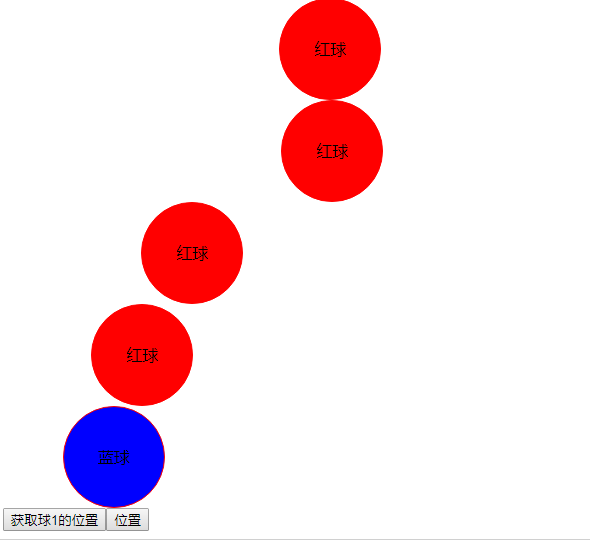

# 二.vue2.x（数据同步）

## 1.js 的加载方式

defer & async/preload & prefetch

- defer 和 async 在网络读取的过程中都是异步解析
- defer 是有顺序依赖的，async 只要脚本加载完后就执行
- preload 可以对当前页面所需的脚本、样式等资源进行预加载
- prefetch 加载的资源一般不是用于当前页面的，是未来很可能用到的这样一类资源

## 2.组件的加载



```vue
<template>
  <div id="app">
    <!--v-model = :value + input  -->
    <!-- :xxx.sync="xxx" = :"xxx" +this.$emit('update:xxx') -->
    <ScrollBall color="red" :target="500" :value.sync="pos4" ref="ball4"
      >红球</ScrollBall
    >
    <ScrollBall
      color="red"
      :value="pos4"
      :target="500"
      @update:value="(value) => (pos4 = value)"
      >红球</ScrollBall
    >
    <ScrollBall color="red" v-model="pos3" :target="500">红球</ScrollBall>
    <ScrollBall color="red" :value="pos1" :target="500" @input="input"
      >红球</ScrollBall
    >
    <ScrollBall color="blue" :value="pos2" :target="500">蓝球</ScrollBall>
    <button @click="getPostion">获取球1的位置</button>
    <button @click="stop">位置</button>
  </div>
</template>

<script>
import ScrollBall from "./components/ScrollBall.vue"
export default {
  name: "app",
  components: {
    ScrollBall,
  },
  data() {
    return {
      pos1: 50,
      pos2: 60,
      pos3: 100,
      pos4: 200,
    }
  },
  methods: {
    input(value) {
      this.pos1 = value
    },
    stop() {
      this.$refs.ball4.stop()
    },
    getPostion(value) {
      console.log(value)
    },
  },
}
</script>

<style lang="less"></style>
```

ScrollBall.vue

```vue
<template>
  <div class="ball" :style="style" :id="ballId">
    <slot></slot>
  </div>
</template>
<script>
// 组件的id问题 _uid
//属性校验 --> 计算属性
//双向通信 props + emit / v-model / .sync
//数据绑定问题 $refs 拿到组件内部的方法 来调用组件中的方法
export default {
  name: "scroll-ball",
  props: {
    color: {
      type: String,
      default: "white",
    },
    value: {
      type: Number,
      default: 0,
    },
    target: {
      type: Number,
      target: 300,
    },
  },
  methods: {
    stop() {
      this.$emit("end")
      cancelAnimationFrame(this.timer)
    },
  },
  mounted() {
    //单向数据流 子组件通知父亲 当前自己的位置 ，父亲更新位置 再传递给子组件
    let ball = document.getElementById(this.ballId)
    this.timer
    let fn = () => {
      let left = this.value
      if (left >= this.target) {
        return cancelAnimationFrame(this.timer)
      }
      this.$emit("input", left + 2)
      this.$emit("update:value", left + 2)
      ball.style.transform = `translate(${left}px)`
      this.timer = requestAnimationFrame(fn)
    }
    this.timer = requestAnimationFrame(fn)
  },
  computed: {
    ballId() {
      return "ball" + this._uid
    },
    style() {
      return {
        background: this.color,
      }
    },
  },
}
</script>

<style lang="less" scoped>
.ball {
  width: 100px;
  height: 100px;
  border-radius: 50%;
  text-align: center;
  line-height: 100%;
  border: 1px solid red;
  line-height: 100px;
}
</style>
```
