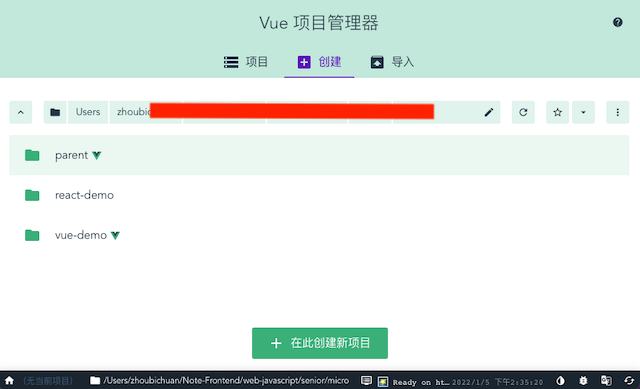
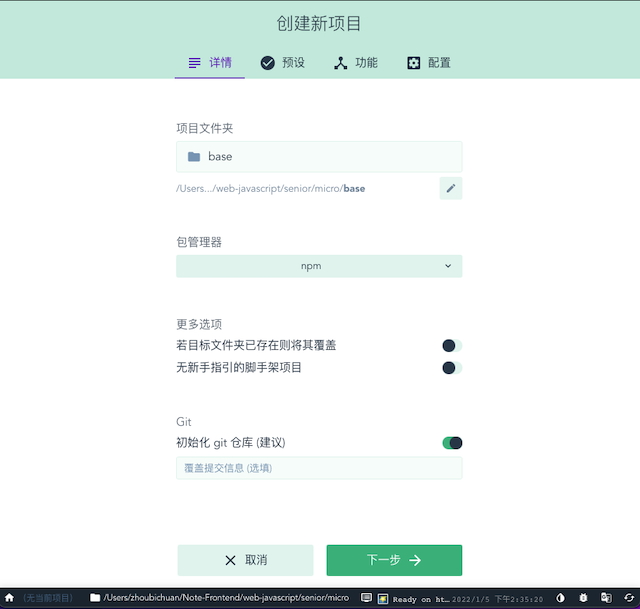
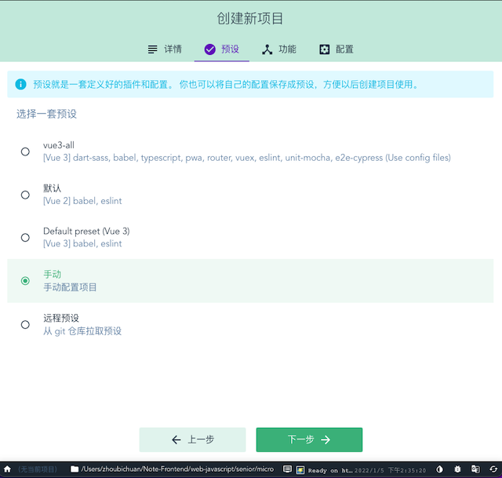
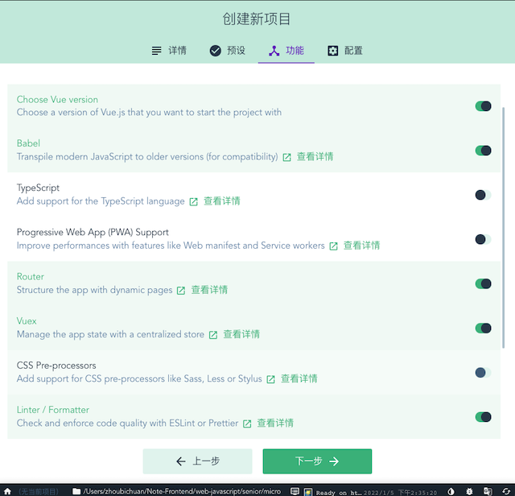
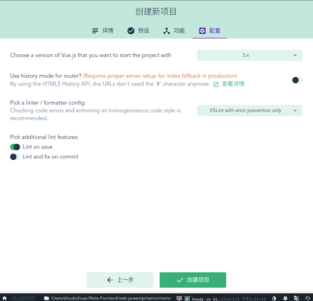
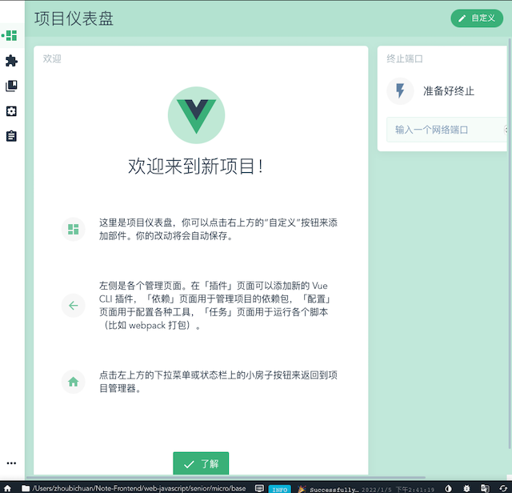
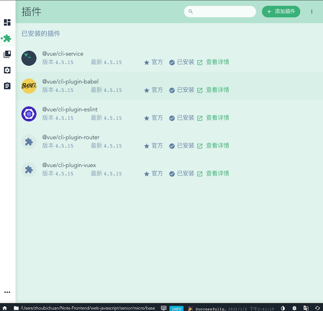
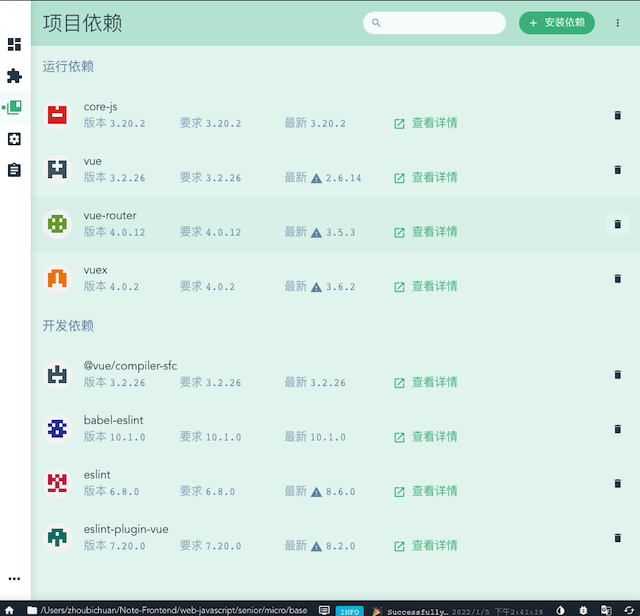
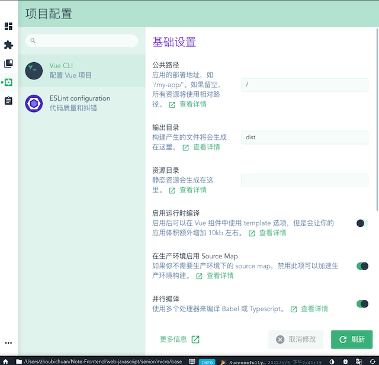

# 一.Vue/cli 3.x

::: tip 前言
补充一些官方文档中没有的，但是实际开发中最好需要了解的内容
:::
## 1.使用 vue-cli3.0 创建项目

```sh
yarn add @vue/cli -g
```

### 1.1 通过图形界面创建项目

```bash
vue ui
```




















### 1.2 使用 vue-cli3.0 创建项目

```sh
vue create my-demo
```

> - 选择模板
>
> ```bash {4}
> ? Please pick a preset:
>  Default ([Vue 2] babel, eslint)          # vue2.x最简配置
>  Default (Vue 3) ([Vue 3] babel, eslint)  # vue3.x最简配置
> ❯ Manually select features                 # 此处选择这个，用自定义配置
> ```
>
> - 选择那种包管理工具
>
> ```bash
> ❯ Use Yarn
>  Use NPM
> ```
>
> - 选择配置
>
> ```bash
> ? Please pick a preset: Manually select features
> ? Check the features needed for your project:        # 全部选中配置
> ◉ Choose Vue version                                # 选择vue版本
> ◉ Babel                                             # babel支持，可以将es6代码转换成es5代码
> ◉ TypeScript                                        # TypeScript支持，让vue支持TypeScript方式开发
> ◉ Progressive Web App (PWA) Support                 # pwa支持，缓存相关资源，提高页面性能
> ◉ Router                                            # 安装vue-router
> ◉ Vuex                                              # 安装vue-vuex
> ◉ CSS Pre-processors                                # 支持css预处
> ◉ Linter / Formatter                                # 支持代码的格式化
> ◉ Unit Testing                                      # 支持单元测试，提高代码的健壮性
> ❯◉ E2E Testing                                       # 支持自动化测试
> ```
>
> > ::: details vue 版本
> >
> > ```sh {6}
> > ? Please pick a preset: Manually select features
> > ? Check the features needed for your project: Choose Vue version, Babel, TS, PWA, Router, Vuex,
> > CSS Pre-processors, Linter, Unit, E2E
> > ? Choose a version of Vue.js that you want to start the project with
> >  2.x
> > ❯ 3.x                                                # 选择这个
> > ```
> >
> > :::
> >
> > ::: details style
> >
> > ```sh {5}
> > ? Please pick a preset: Manually select features
> > ? Check the features needed for your project: Choose Vue version, Babel, TS, PWA, Router, Vuex,
> > CSS Pre-processors, Linter, Unit, E2E
> > ? Choose a version of Vue.js that you want to start the project with 3.x
> > ? Use class-style component syntax? (y/N) y         # 选择y
> > ```
> >
> > :::
> > ::: details babel 配置
> >
> > ```sh {7}
> > ? Please pick a preset: Manually select features
> > ? Check the features needed for your project: Choose Vue version, Babel, TS, PWA, Router, Vuex,
> > CSS Pre-processors, Linter, Unit, E2E
> > ? Choose a version of Vue.js that you want to start the project with 3.x
> > ? Use class-style component syntax? Yes
> > ? Use Babel alongside TypeScript (required for modern mode, auto-detected polyfills, transpiling
> > JSX)? (Y/n) y                                     # 选择y
> > ```
> >
> > ::::
> > ::: details 是否使用路由的 history 模式
> >
> > ```sh {9}
> > ? Please pick a preset: Manually select features
> > ? Check the features needed for your project: Choose Vue version, Babel, TS, PWA, Router, Vuex,
> > CSS Pre-processors, Linter, Unit, E2E
> > ? Choose a version of Vue.js that you want to start the project with 3.x
> > ? Use class-style component syntax? Yes
> > ? Use Babel alongside TypeScript (required for modern mode, auto-detected polyfills, transpiling
> > JSX)? Yes
> > ? Use history mode for router? (Requires proper server setup for index fallback in production) (
> > Y/n) y                                            # 选择y（在生产环境中需要适当的服务器设置以备索引）
> > ```
> >
> > :::
> > ::: details 选择 css 预处理器
> >
> > ```sh {12}
> > ? Please pick a preset: Manually select features
> > ? Check the features needed for your project: Choose Vue version, Babel, TS, PWA, Router, Vuex,
> > CSS Pre-processors, Linter, Unit, E2E
> > ? Choose a version of Vue.js that you want to start the project with 3.x
> > ? Use class-style component syntax? Yes
> > ? Use Babel alongside TypeScript (required for modern mode, auto-detected polyfills, transpiling
> > JSX)? Yes
> > ? Use history mode for router? (Requires proper server setup for index fallback in production) Y
> > es
> > ? Pick a CSS pre-processor (PostCSS, Autoprefixer and CSS Modules are supported by default): (Us
> > e arrow keys)
> > ❯ Sass/SCSS (with dart-sass)                    # 选择这个
> >  Sass/SCSS (with node-sass)
> >  Less
> >  Stylus
> > ```
> >
> > :::
> > ::: details 选择 Eslint 代码验证规则
> >
> > ```sh {13}
> > ? Please pick a preset: Manually select features
> > ? Check the features needed for your project: Choose Vue version, Babel, TS, PWA, Router, Vuex,
> > CSS Pre-processors, Linter, Unit, E2E
> > ? Choose a version of Vue.js that you want to start the project with 3.x
> > ? Use class-style component syntax? Yes
> > ? Use Babel alongside TypeScript (required for modern mode, auto-detected polyfills, transpiling
> > JSX)? Yes
> > ? Use history mode for router? (Requires proper server setup for index fallback in production) Y
> > es
> > ? Pick a CSS pre-processor (PostCSS, Autoprefixer and CSS Modules are supported by default): Sas
> > s/SCSS (with dart-sass)
> > ? Pick a linter / formatter config: (Use arrow keys)
> > ❯ ESLint with error prevention only            # 选择这个
> >  ESLint + Airbnb config
> >  ESLint + Standard config
> >  ESLint + Prettier
> >  TSLint (deprecated)
> > ```
> >
> > :::
> > ::: details 选择什么时候进行代码规则检测
> >
> > ```sh {15}
> > ? Please pick a preset: Manually select features
> > ? Check the features needed for your project: Choose Vue version, Babel, TS, PWA, Router, Vuex,
> > CSS Pre-processors, Linter, Unit, E2E
> > ? Choose a version of Vue.js that you want to start the project with 3.x
> > ? Use class-style component syntax? Yes
> > ? Use Babel alongside TypeScript (required for modern mode, auto-detected polyfills, transpiling
> > JSX)? Yes
> > ? Use history mode for router? (Requires proper server setup for index fallback in production) Y
> > es
> > ? Pick a CSS pre-processor (PostCSS, Autoprefixer and CSS Modules are supported by default): Sas
> > s/SCSS (with dart-sass)
> > ? Pick a linter / formatter config: Basic
> > ? Pick additional lint features: (Press <space> to select, <a> to toggle all, <i> to invert sele
> > ction)
> > ❯◉ Lint on save                               # 保存就检测,选择这个
> > ◯ Lint and fix on commit                     # fix和commit时候检查
> > ```
> >
> > :::
> > ::: details 单元测试配置
> >
> > ```sh {15}
> > ? Please pick a preset: Manually select features
> > ? Check the features needed for your project: Choose Vue version, Babel, TS, PWA, Router, Vuex,
> > CSS Pre-processors, Linter, Unit, E2E
> > ? Choose a version of Vue.js that you want to start the project with 3.x
> > ? Use class-style component syntax? Yes
> > ? Use Babel alongside TypeScript (required for modern mode, auto-detected polyfills, transpiling
> > JSX)? Yes
> > ? Use history mode for router? (Requires proper server setup for index fallback in production) Y
> > es
> > ? Pick a CSS pre-processor (PostCSS, Autoprefixer and CSS Modules are supported by default): Sas
> > s/SCSS (with dart-sass)
> > ? Pick a linter / formatter config: Basic
> > ? Pick additional lint features: Lint on save
> > ? Pick a unit testing solution: (Use arrow keys)
> > ❯ Mocha + Chai                               # 选择这个
> >  Jest
> > ```
> >
> > :::
> > ::: details 选择 e2e 测试
> >
> > ```sh {16}
> > ? Please pick a preset: Manually select features
> > ? Check the features needed for your project: Choose Vue version, Babel, TS, PWA, Router, Vuex,
> > CSS Pre-processors, Linter, Unit, E2E
> > ? Choose a version of Vue.js that you want to start the project with 3.x
> > ? Use class-style component syntax? Yes
> > ? Use Babel alongside TypeScript (required for modern mode, auto-detected polyfills, transpiling
> > JSX)? Yes
> > ? Use history mode for router? (Requires proper server setup for index fallback in production) Y
> > es
> > ? Pick a CSS pre-processor (PostCSS, Autoprefixer and CSS Modules are supported by default): Sas
> > s/SCSS (with dart-sass)
> > ? Pick a linter / formatter config: Basic
> > ? Pick additional lint features: Lint on save
> > ? Pick a unit testing solution: Mocha
> > ? Pick an E2E testing solution: (Use arrow keys)
> > ❯ Cypress (Chrome only)                     # 选择这个
> >  Nightwatch (WebDriver-based)
> >  WebdriverIO (WebDriver/DevTools based)
> > ```
> >
> > :::
> > ::: details 把 babel,postcss,eslint 这些配置文件放哪
> >
> > ```sh {17}
> > ? Please pick a preset: Manually select features
> > ? Check the features needed for your project: Choose Vue version, Babel, TS, PWA, Router, Vuex,
> > CSS Pre-processors, Linter, Unit, E2E
> > ? Choose a version of Vue.js that you want to start the project with 3.x
> > ? Use class-style component syntax? Yes
> > ? Use Babel alongside TypeScript (required for modern mode, auto-detected polyfills, transpiling
> > JSX)? Yes
> > ? Use history mode for router? (Requires proper server setup for index fallback in production) Y
> > es
> > ? Pick a CSS pre-processor (PostCSS, Autoprefixer and CSS Modules are supported by default): Sas
> > s/SCSS (with dart-sass)
> > ? Pick a linter / formatter config: Basic
> > ? Pick additional lint features: Lint on save
> > ? Pick a unit testing solution: Mocha
> > ? Pick an E2E testing solution: Cypress
> > ? Where do you prefer placing config for Babel, ESLint, etc.? (Use arrow keys)
> > ❯ In dedicated config files                 # 独立文件放置,选择这个
> >  In package.json                           # 存放到package.json里
> > ```
> >
> > :::
> > ::: details 是否保存本次的配置
> >
> > ```sh {17}
> > ? Please pick a preset: Manually select features
> > ? Check the features needed for your project: Choose Vue version, Babel, TS, PWA, Router, Vuex,
> > CSS Pre-processors, Linter, Unit, E2E
> > ? Choose a version of Vue.js that you want to start the project with 3.x
> > ? Use class-style component syntax? Yes
> > ? Use Babel alongside TypeScript (required for modern mode, auto-detected polyfills, transpiling
> > JSX)? Yes
> > ? Use history mode for router? (Requires proper server setup for index fallback in production) Y
> > es
> > ? Pick a CSS pre-processor (PostCSS, Autoprefixer and CSS Modules are supported by default): Sas
> > s/SCSS (with dart-sass)
> > ? Pick a linter / formatter config: Basic
> > ? Pick additional lint features: Lint on save
> > ? Pick a unit testing solution: Mocha
> > ? Pick an E2E testing solution: Cypress
> > ? Where do you prefer placing config for Babel, ESLint, etc.? In dedicated config files
> > ? Save this as a preset for future projects? (y/N) y   # 是否记录一下以便下次继续使用这套配置，选择是(y)
> > ```
> >
> > :::
> >
> > ::: details 配置名称
> >
> > ```sh {18}
> > ? Please pick a preset: Manually select features
> > ? Check the features needed for your project: Choose Vue version, Babel, TS, PWA, Router, Vuex,
> > CSS Pre-processors, Linter, Unit, E2E
> > ? Choose a version of Vue.js that you want to start the project with 3.x
> > ? Use class-style component syntax? Yes
> > ? Use Babel alongside TypeScript (required for modern mode, auto-detected polyfills, transpiling
> > JSX)? Yes
> > ? Use history mode for router? (Requires proper server setup for index fallback in production) Y
> > es
> > ? Pick a CSS pre-processor (PostCSS, Autoprefixer and CSS Modules are supported by default): Sas
> > s/SCSS (with dart-sass)
> > ? Pick a linter / formatter config: Basic
> > ? Pick additional lint features: Lint on save
> > ? Pick a unit testing solution: Mocha
> > ? Pick an E2E testing solution: Cypress
> > ? Where do you prefer placing config for Babel, ESLint, etc.? In dedicated config files
> > ? Save this as a preset for future projects? Yes
> > ? Save preset as: vue3-all                             # 选保存之后，会让你写一个配置的名字,下次进入配置可以直接使用你这次的配置,配置名称vue3-all
> > ```
> >
> > :::

### 1.3 启动项目

```sh
cd my-demo && yarn install
yarn run serve
```

## 2.项目介绍

### 1.查看帮助

1.查看 vue 中相关的配置

```sh
-- help
```

2.查看 webpack 的相关配置，vue-cli3.0 中将原先的 webpack 配置隐藏起来了

```sh
vue inspect
```

cmd 中出现 webpack 的配置信息：

```sh
 /* config.module.rule('css').oneOf('vue') */
{
resourceQuery: /\?vue/,
use: [
    /* config.module.rule('css').oneOf('vue').use('vue-style-loader') */
    {
    loader: 'vue-style-loader',
    options: {
        sourceMap: false,
        shadowMode: false
    }
    },
    /* config.module.rule('css').oneOf('vue').use('css-loader') */
    {
    loader: 'css-loader',
    options: {
        sourceMap: false,
        importLoaders: 2
    }
    },
    /* config.module.rule('css').oneOf('vue').use('postcss-loader') */
    {
    loader: 'postcss-loader',
    options: {
        sourceMap: false
    }
    }
]
},
```

### 2.配置 webpack

1.打包项目

```sh
yarn run build
```

可以看到打包后的项目中资源路径都是相对路径，当我们项目上线的时候有的资源路径是 url 路径，而且有时候会修改静态资源的路径

2.配置资源路径

在项目根目录下面新建 vue.config.js 文件,配置生成环境的资源地址，和文件路径

```sh
module.exports={
    publicPath:process.env.NODE_ENV==="production"?'http://www.zhufeng.cn':'/',
    assetsDir:'asserts'
}
```

3.配置输出目录

```sh
outputDir:'./my-dist'
```

打包后的路径为 my-dist

4.使用模板方式

vue-cli3.0 中 main.js 中默认使用 render 函数渲染

```js
new Vue({
  render: (h) => h(App),
}).$mount("#app")
```

如果要在 main.js 中配置使用 template

```js
new Vue({
  template: "<h1>hello</h1>",
}).$mount("#app")
```

则需要配置

```sh
runtimeCompiler:true
```

5.sourceMap

默认会打包 sourceMap 文件，生产需要去掉，可以配置

```sh
productionSourceMap:false
```

### 3.chainWebpack

控制 webpack 内部配置

如：配置目录别名

```js
chainWebpack: (config) => {
  config.resolve.alias.set("+", path.resolve(__dirname, "src"))
}
```

### 4.configuireWebpack

和 merge 功能一致

```json
configureWebpack:{
    plugins:[],
    module:{

    }
}
```

### 5.代理请求

项目中发送请求

```js
 mounted(){
    axios.get('/getUser').then(data=>{
      console.log(data)
    })
  }
```

项目中写一个服务 server.js

```js
let express = require("express")
let app = express()

app.get("/getUser", (req, res) => {
  res.json({ name: "zfpx" })
})
app.listen(3000)
```

出现跨域

这时需要使用 webpack 的代理

```js
devServer:{
    proxy:{
        '/api/getUser':{
            target:'http://localhost:3000',
            pathRewrite:{
                '/api':''
            }
        }
    }
}
```

### 6.第三方插件配置

写一个公共的 less 文件，每个页面都需要引入，这里不用手动引入直接用插件
assets 路径下新建 common.less 文件

```css
@color: "red";
```

```sh
vue add style-resources-loader
```

选择 less

这时会自动在 vue.config.js 中注入文件,加入路径

```js
patterns: [path.resolve(__dirname, "src/assets/common.less")]
```

运行项目会看到字体变红

[完整的项目地址]('https://github.com/zhoubichuan/FrontEndNote/1.base/5.frames/2.Vue/vue-cli3.0>')
