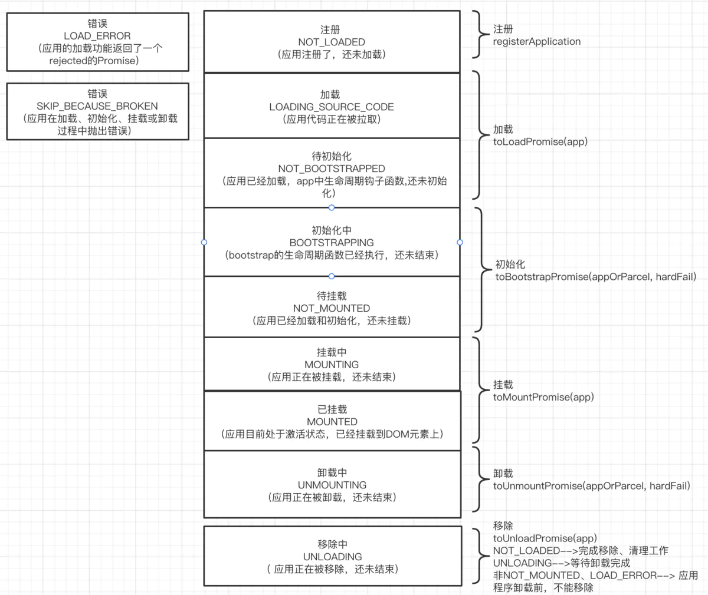

# 一.singlespa（用法解析）

## 1.构建子应用

```sh
vue create spa-vue
npm install single-spa-vue
```

- mian.js

```js
import singleSpaVue from "single-spa-vue"
const appOptions = {
  el: "#vue",
  router,
  render: (h) => h(App),
}
// 在非子应用中正常挂载应用
if (!window.singleSpaNavigate) {
  delete appOptions.el
  new Vue(appOptions).$mount("#app")
}
const vueLifeCycle = singleSpaVue({
  Vue,
  appOptions,
})
// 子应用必须导出 以下生命周期 bootstrap、mount、unmount
export const bootstrap = vueLifeCycle.bootstrap
export const mount = vueLifeCycle.mount
export const unmount = vueLifeCycle.unmount
export default vueLifeCycle
```

- router.js

```js
const router = new VueRouter({
  mode: "history",
  base: "/vue",
  routes,
})
```

## 2.配置库打包

```js
module.exports = {
  configureWebpack: {
    output: {
      library: "singleVue",
      libraryTarget: "umd",
    },
    devServer: {
      port: 10000,
    },
  },
}
```

## 3.主应用搭建

```html
<div id="nav">
  <router-link to="/vue">vue项目</router-link>
  <div id="vue"></div>
</div>
```

- main.js

```js
import Vue from "vue"
import App from "./App.vue"
import router from "./router"
import ElementUI from "element-ui"
import "element-ui/lib/theme-chalk/index.css"
Vue.use(ElementUI)
const loadScript = async (url) => {
  await new Promise((resolve, reject) => {
    const script = document.createElement("script")
    script.src = url
    script.onload = resolve
    script.onerror = reject
    document.head.appendChild(script)
  })
}
import { registerApplication, start } from "single-spa"
registerApplication(
  "singleVue",
  async () => {
    await loadScript("http://localhost:10000/js/chunk-vendors.js")
    await loadScript("http://localhost:10000/js/app.js")
    return window.singleVue
  },
  (location) => location.pathname.startsWith("/vue")
)
start()
new Vue({
  router,
  render: (h) => h(App),
}).$mount("#app")
```

## 4.动态设置子应用 `publicPath`

```js
if (window.singleSpaNavigate) {
  __webpack_public_path__ = "http://localhost:10000/"
}
```

## 5.状态

注册、加载、初始化、挂载、卸载、移除、错误

