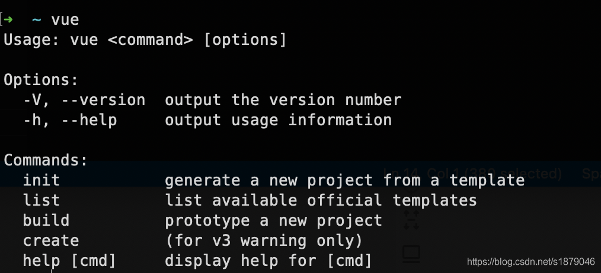
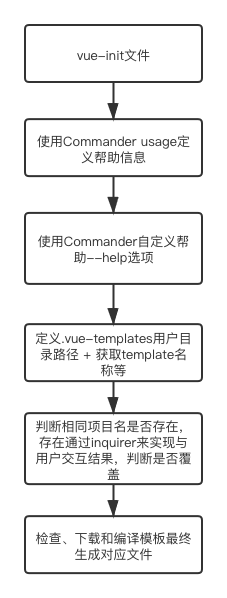

# 源码概览(cli2.x)

## 1.vue 命令的逻辑

在 vue-cli 项目的 package.json 文件中定义了命令对应的文件位置，具体如下：

```json
"bin": {
 "vue": "bin/vue",
    "vue-init": "bin/vue-init",
    "vue-list": "bin/vue-list"
}
```

vue 命令对应的 bin/vue 文件的源码比较简单，这里就直接贴出来具体如下：

```sh
#!/usr/bin/env node
const program = require('commander')

program
  .version(require('../package').version)
  .usage('<command> [options]')
  .command('init', 'generate a new project from a template')
  .command('list', 'list available official templates')
  .command('build', 'prototype a new project')
  .command('create', '(for v3 warning only)')

program.parse(process.argv)
```

commander 是 Node.js 命令行的解决方案（即 Node.js 下实现自定义命令），点此查看 commander 中文文档。

这里简单介绍下常用相关方法：

- version：定义版本
- usage：帮助信息输出
- command：使用独立的可执行文件作为子命令
- option：定义选项
- parse：解析参数用于匹配对应选项或命令

当在控制台中输入 vue 命令，会输出相关的命令和帮助信息，如下：



这里定义了子命令 init 等， Commander 将会尝试在 vue 脚本的目录中搜索 program-command 形式的可执行文件例如 init 会查找 vue-init 等。

## 2.vue init 命令的逻辑

vue-cli 脚手架工具中可以使用 vue init 或 vue-init 命令来初始化项目，命令最终都对应 bin/vue-init 文件。
vue-init 文件的逻辑流程主要如下：



vue-init 文件逻辑中有几个重要的依赖包：

- commander：命令行处理
- download-git-repo：Node.js 下 git 仓库下载处理
- inquirer：Node 下用户与命令行交互处理
- ora：终端加载优化处理

vue init 语法是：

```sh
vue init <template-name> <project-name>
```

vue 官方提供了不同的模板（对应着不同的构建工具等），这些模块仓库都位于 vuejs-templates 中，简单概括对应了两类：webpack 模板和 browserify 模板。
当然个人也可以自己的模块仓库，通过自有模块来初始化项目，语法如下：

```sh
vue init username/repo <project-name>
```

当 webpack 模板来初始化项目，其执行逻辑简要概括如下：

- 判断当前目录是否存在相同名称的目录，存在需要与用户交互处理
- 使用 download-git-repo 来下载对应的模块仓库，会在用户目录下创建.vue-templates 目录，该目录下存在 webpack 模板仓库
- 编译 webpack 模板仓库生成最终的文件

## 3.run 函数

该函数的逻辑是检查、下载和编译模板的入口，实际上其逻辑主要就分成 3 部分：

### 3.1 检查部分的逻辑

实际上检查部分的逻辑主要是：

- 创建是否是本地模板

vue 脚手架支持依据本地模板来初始化项目，源码中判断本地模块是通过路径来进行的，即脚手架对于以./、/或 window 环境下[a-zA-Z]:的开头的路径都看成是使用本地模板

- 对于非本地模板检查相关信息
  - 首先会检查对应 node 版本和 vue-cli 是否存在新版本
  - 其次会检查模板路径是否存在 / 来判断是否使用官方模板还是非官方模板

### 3.2 下载部分的逻辑

该部分就是调用 download-git-repo 库提供的方法下载对应的 git 模板仓库，其源码具体如下：

```js
// 模板下载优化
const spinner = ora("downloading template")
spinner.start()
// 本地模板存在就删除掉重新下载
if (exists(tmp)) rm(tmp)
// 下载
download(template, tmp, { clone }, (err) => {
  // 下载成功后逻辑
  spinner.stop()
  if (err)
    logger.fatal(
      "Failed to download repo " + template + ": " + err.message.trim()
    )
})
```

## 4.模板编译

模板编译是在模板成功下载过后立即执行的，调用的是自定义模块 generate 下的 generate 方法，该模块负责模板编译的具体逻辑。generate 模块依赖几个重要的第三方 NPM 包，具体如下：

- handlebars：轻量级语义化模板（点此查看 handlebars 中文文档）
- consolidate：模板引擎整合库，支持目前比较流行的模板库
- metalsmith：静态站点生成器

::: warning 首先明确下为什么需要 handlebars 包？
因为官方 vuejs-templates 仓库提供的模板是使用 handlebars 来编写的
:::

接下来具体看看 generate 模块的具体逻辑，其逻辑主要有如下几点：

### 4.1 获取 options

实际上获取 options 的逻辑比较简单，直接贴源码：

```js
module.exports = function options(name, dir) {
  // 模板位置的实际路径
  const opts = getMetadata(dir)
  // 默认项目名
  setDefault(opts, "name", name)
  setValidateName(opts)
  // 默认用户名
  const author = getGitUser()
  if (author) {
    setDefault(opts, "author", author)
  }

  return opts
}
```

该函数主要的逻辑是 getMetadata，实际上这是脚手架模板仓库的必要设置，即模板仓库必须存在 meta.json 或 meta.js 的。

```js
function getMetadata (dir) {
  const json = path.join(dir, 'meta.json')
  const js = path.join(dir, 'meta.js')
  // 获取对应文件内容
  return opts
```

这里以官方模板 vuejs-templates/webpack 为例，这里看看其 meta.js 的设置，该文件主要包含下面几项：

- metalsmith 对象
- helpers 对象
- prompts 对象
- filters 对象
- complete 函数

这里 meta.js 的配置信息是用在后续的逻辑中，这里暂时先不展开，后续逻辑在针对性的说明。

### 4.2 helpers

Handlebars 是一种简单的模板语言，它使用模板和输入对象来生成 HTML 或其他文本格式。
在 generate 模块中关于 Handlebars 的逻辑都是调用 Handlebars.registerHelper 函数。

Handlebars.registerHelper 是提供用户自定义助手的功能
generate 模板中的定义的助手代码有：

- if_eq
- unless_eq
- if_or
- template_version

为模板逻辑服务，具体可以看 Handlebars 的使用和官方模板的具体使用，这里具体就不展开的

### 4.3 metalsmith

使用第三方库 metalsmith 读取模板仓库中 template 目录，并对模板的 meta 数据做相关处理。
Metalsmith 是静态站点生成器，其工作原理简单概括只是三个简单步骤：

读取源目录中的所有文件
调用一系列处理文件的插件
将结果写入目标目录
Metalsmith 核心逻辑只有读取源目录文件以及输出处理后的文件，所有对于文件的处理都是通过创建来完成的。
从 Metalsmith 官网对于其工作原理的说明，可以看出与构建工具 Glup 等相似。
vue 脚手架使用 Metalsmith 原因：

Metalsmith 可以自定义插件来实现一些流程性工作
实际上脚手架中对于 Metalsmith 的使用逻辑就是自定义流程，具体流程如下：

```js
// metalsmith.use就是使用插件
metalsmith
  .use(askQuestions(opts.prompts))
  .use(filterFiles(opts.filters))
  .use(renderTemplateFiles(opts.skipInterpolation))
```

### 4.4 askQuestions

vue init 命令执行后首先会下载模板之后会有一系列与用户交互的处理，askQuestions 插件就是使用 inquirer 库处理与用户交互的，处理信息定义在 meta.js 中，即获取 options 中的 prompts 对象。

具体的交互信息内容简单如下：

Project name：项目名
Project description：项目描述
Author：作者
Vue build
Install vue-router
ESLint 相关
测试相关
自动安装依赖方式选择

### 4.5 filterFiles

过滤相关文件，主要是 eslint 相关、测试相关，这需要根据之前与用户交互的结果来看是否删除对应文件或目录（官方模板默认是包含所有的文件的）。

### 4.6 renderTemplateFiles

该自定义插件逻辑就是处理所有模块文件，该插件使用 consolidate 库来调用对应的模板引擎来处理每一个文件，vue 官方模板是采用 Handlebars 模板语言的，所以也是采用对应 Handlebars 的模板引擎来处理的。

输出处理后的模板文件相关逻辑

具体源码如下：

```js
metalsmith
  .clean(false)
  .source(".") // start from template root instead of `./src` which is Metalsmith's default for `source`
  .destination(dest)
  .build((err, files) => {
    done(err)
    if (typeof opts.complete === "function") {
      const helpers = { chalk, logger, files }
      opts.complete(data, helpers)
    } else {
      logMessage(opts.completeMessage, data)
    }
  })
```

这部分的逻辑就是定义输出目录的路径和具体的编译逻辑，这里涉及到 metalsmith 的使用，这里就不展开。
需要注意 complete 函数的逻辑，在模板文件编译输出后会执行 complete 函数的逻辑，实际上该函数逻辑主要就是自动按照依赖，complete 函数主要逻辑如下：

```js
  complete: function(data, { chalk }) {
   // 安装依赖
    if (data.autoInstall) {
      installDependencies(cwd, data.autoInstall, green);
    } else {
      printMessage(data, chalk)
    }
  },
```

vue init 命令的执行逻辑至此完成。

::: tip 总结

```sh
vue init webpack vue-demo
```

基于上面命令，这里总结下 vue 脚手架初始化项目的整体流程：

- 基于第三方库 commander 建立脚手架提供的自定义命令
- 判断模板类型是本地模板、官方模板还是自定义模板，做相关处理，这里使用官方模板
- 使用第三方库 download-git-repo 下载官方模板 vuejs-templates 的 webpack 模块仓库
- 开启对 webpack 模板仓库的编译，输出编译后的模板到指定目录
  - 首先读取 webpack 模板仓库的 meta.js 或 meta.json 文件，获取到对应的 options 对象
  - 然后使用 metalsmith 整合流程：使用 ininquirer 处理与用户交互、过滤文件、使用 consolidate 调用模板引擎编译所有模板文件
  - metalsmith 输出处理后的文件到指定目录下

通过对 vue-cli 脚手架的分析，知道了目前在 Node.js 环境下如何实现脚手架，同时也对 vue 官方模板等有了较为细致的了解，这对个人定制 vue 项目模板是非常有帮助的。
:::
