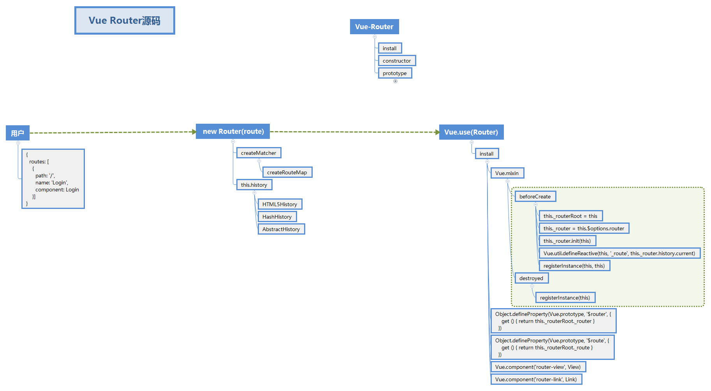

# 源码概览



## 用户代码
router/index.js
```js
import Vue from "vue";
import Router from "vue-router";
Vue.use(Router);
export default new Router({
  routes: [{
      path: "/",
      redirect: {
        path: "/message"
      }
    }
  ]
});
```
## Vue加载VueRouter插件
```js
Vue.use = function (plugin) {
  const installedPlugins = (this._installedPlugins || (this._installedPlugins = []))
  if (installedPlugins.indexOf(plugin) > -1) {
    return this
  }

  const args = toArray(arguments, 1)
  args.unshift(this)
  if (typeof plugin.install === 'function') {
    plugin.install.apply(plugin, args)
  } else if (typeof plugin === 'function') {
    plugin.apply(null, args)
  }
  installedPlugins.push(plugin)
  return this
}
```
## 实例化Vue Router
- VueRouter 类
```js
class VueRouter {
  constructor (options = {}) {
    this.app = null;
    this.apps = [];
    this.options = options;
    this.beforeHooks = [];
    this.resolveHooks = [];
    this.afterHooks = [];
    this.matcher = createMatcher(options.routes || [], this); // 用户的配置信息传入

    let mode = options.mode || 'hash';
    this.fallback =
      mode === 'history' && !supportsPushState && options.fallback !== false;
    if (this.fallback) {
      mode = 'hash';
    }
    if (!inBrowser) {
      mode = 'abstract';
    }
    this.mode = mode;

    switch (mode) {
      case 'history':
        this.history = new HTML5History(this, options.base);
        break
      case 'hash':
        this.history = new HashHistory(this, options.base, this.fallback);
        break
      case 'abstract':
        this.history = new AbstractHistory(this, options.base);
        break
      default:
        {
          assert(false, `invalid mode: ${mode}`);
        }
    }
  }

  match (raw, current, redirectedFrom) {
    return this.matcher.match(raw, current, redirectedFrom)
  }

  get currentRoute () {
    return this.history && this.history.current
  }

  init (app) { // 初始化阶段
    ...
  }

  beforeEach (fn) {
    return registerHook(this.beforeHooks, fn)
  }

  beforeResolve (fn) {
    return registerHook(this.resolveHooks, fn)
  }

  afterEach (fn) {
    return registerHook(this.afterHooks, fn)
  }

  onReady (cb, errorCb) {
    this.history.onReady(cb, errorCb);
  }

  onError (errorCb) {
    this.history.onError(errorCb);
  }

  push (location, onComplete, onAbort) {
    // $flow-disable-line
    if (!onComplete && !onAbort && typeof Promise !== 'undefined') {
      return new Promise((resolve, reject) => {
        this.history.push(location, resolve, reject);
      })
    } else {
      this.history.push(location, onComplete, onAbort);
    }
  }

  replace (location, onComplete, onAbort) {
    // $flow-disable-line
    if (!onComplete && !onAbort && typeof Promise !== 'undefined') {
      return new Promise((resolve, reject) => {
        this.history.replace(location, resolve, reject);
      })
    } else {
      this.history.replace(location, onComplete, onAbort);
    }
  }

  go (n) {
    this.history.go(n);
  }

  back () {
    this.go(-1);
  }

  forward () {
    this.go(1);
  }

  getMatchedComponents (to) {
    const route = to
      ? to.matched
        ? to
        : this.resolve(to).route
      : this.currentRoute;
    if (!route) {
      return []
    }
    return [].concat.apply(
      [],
      route.matched.map(m => {
        return Object.keys(m.components).map(key => {
          return m.components[key]
        })
      })
    )
  }

  resolve (
    to,
    current,
    append
  ) {
    current = current || this.history.current;
    const location = normalizeLocation(to, current, append, this);
    const route = this.match(location, current);
    const fullPath = route.redirectedFrom || route.fullPath;
    const base = this.history.base;
    const href = createHref(base, fullPath, this.mode);
    return {
      location,
      route,
      href,
      // for backwards compat
      normalizedTo: location,
      resolved: route
    }
  }

  addRoutes (routes) {
    this.matcher.addRoutes(routes);
    if (this.history.current !== START) {
      this.history.transitionTo(this.history.getCurrentLocation());
    }
  }
}
```
## 使用Router