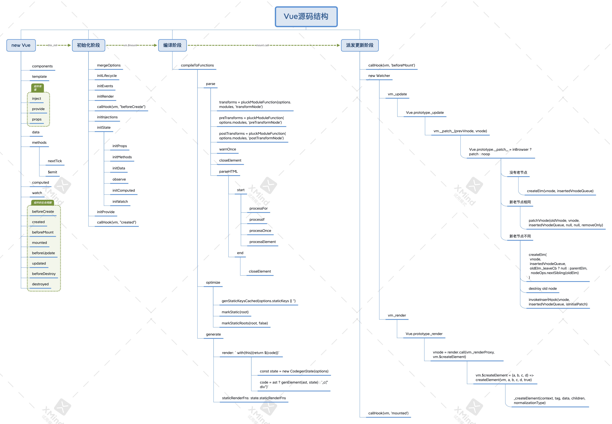
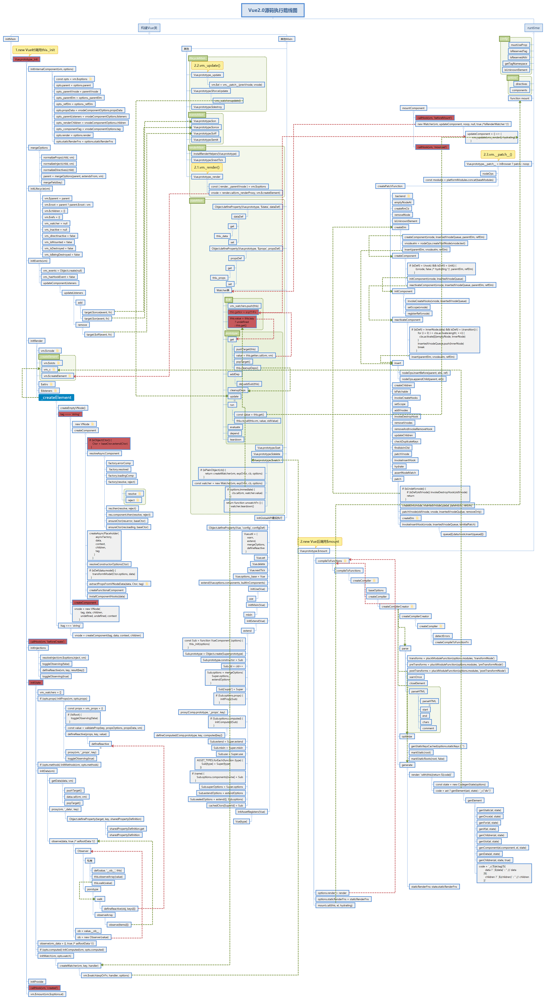

# Vue2.x 源码概览

::: tip 前言
简单介绍 vue（v2.7.14） 内部运行原理，模板代码与 options 代码是如何关联起来的
:::

- vue 框架时一个以`MVVM`为架构的前端框架
  - M:代表数据，这里可以简单理解成项目中 `data` 对象数据
  - V:代表视图，这里可以简单理解为项目中`template`模板
  - VM:代表视图模型，是连接数据和视图的桥梁，可以简单理解为数据劫持，`data`变化通过视图模型更新到视图上，`template`变化通过事件监听更新`data`，然后通过视图模型更新视图
- 代码初次流程结构示意图

```js
`main.js `                   |   `Vue2.x`
import App from './App.vue'  |
1.new Vue({      <--------   |            1._init                      3.$mount
    render(h) {              |                |                            |
      return h(<App />);     |                |                            |
    },                       |        1.0.mergeOptions                   render
2}).$mount("#app");          |                |                            |
- - - - - - - - - - - - - - -|          initLifecycle                     vnode
2<template>{{a}}</template>  |                |                            |
<script>                     |            initEvents                      path
1.0.export default {         |                |                            |
  1.2.data() {               |            initRender                      dom
    return {                 |                |
      a: ''                  |         1.1.beforeCreate
    }                        |                |
  },                         |        1.2.initInjections
  1.3.props:{                |                |
   a:{                       |           1.3.initState
      type:String            |                |
     }                       |          1.4.initProvide
  },                         |                |
  1.4.provide:{              |           1.5.created
    b:this                   |
  },                         |            2.$mount
  1.2.inject:{               |                |
    b: 'b'                   |             2.compiler
  },                         |                |
  1.1.beforeCreate(){},      |               ast
  1.5.created(){},           |                |
  beforeMount(){},           |             optimize
  mounted(){},               |                |
  methods:{}                 |             gencode
 }                           |
 </script>                   |
`App.vue`                    |
                             |
                             |
                             |

```

## 1.不同项目

### 1.1 首次加载

通过以下案例来了解 Vue 首次加载的全部过程：

```js
import Vue from "vue"
new Vue({
  render(h) {
    return h(<App />)
  },
}).$mount("#app")
```

这里就包含两大部分：

- 实例化 Vue,将相关参数以对象的形式传入到 Vue 内部
- 调用 Vue 实例上的\$mount 方法

> 据此可以将 Vue 看成两个阶段：

- new Vue 阶段
  - 1.\_init：将用户传入的参数进行初始化处理
- \$mount 阶段
  - 2.\$mount: 将 template 模板进行编译生成 render 函数
  - 3.mount: 实例化组件 Watch，将 render 转换为 Vnode,将 Vnode 插入到 dom 中

### 1.2 组件更新

### 1.3 组件销毁

### 1.4 异步组件

### 1.5 源码结构

```sh
├── compiler                          # 编译相关
│   ├── codegen                       # ├── 将编译结果生成render
│   ├── directives                    # ├── 编译指令
│   ├── parser                        # ├── 解析template
│   ├── create-compiler.js            # ├── 创建编译函数
│   ├── error-detector.js             # ├──
│   ├── helpers.js                    # ├──
│   ├── index.js                      # ├── 入口文件
│   ├── optimizer.js                  # ├── 优化编译结果
│   └── to-function.js                # └──
├── core                              # 核心代码
│   ├── components                    # ├── 组件相关
│   ├── global-api                    # ├── 全局API
│   ├── instance                      # ├── 创建Vue实例
│   ├── observer                      # ├── 响应式
│   ├── util                          # ├── 工具方法
│   ├── vdom                          # ├── 虚拟dom
│   ├── config.js                     # ├──
│   └── index.js                      # └── 入口文件
├── platforms                         # 不同平台的支持
│   ├── web                           # ├── web平台
│   └── weex                          # └── weex平台
├── server                            # 服务
│   ├── bundle-renderer               # ├──
│   ├── optimizing-compiler           # ├──
│   ├── template-renderer             # ├──
│   ├── webpack-plugin                # ├──
│   ├── create-basic-renderer.js      # ├──
│   ├── create-renderer.js            # ├── 路由配置文件
│   ├── render-context.js             # ├──
│   ├── render-stream.js              # ├──
│   ├── render.js                     # ├── 渲染相关
│   ├── util.js                       # ├── 工具方法
│   └── write.js                      # └──
├── sfc                               # .vue 文件解析
│   └── parser.js                     # └──
├── shared                            # 共享代码
│   ├── constants.js                  # ├── 路由配置文件
│   └── util.js                       # └── 共享工具方法
```

### 1.6 源码运行示意图




## 1.\_init 阶段

用户在 `new Vue(options)`时会将用户的数据传递到 vue 内部做处理。

Vue 会调用 `_init` 函数进行初始化

```js
function Vue(options) {
  this._init(options)
}
```

这里的 `init` 过程，它会合并配置，初始化生命周期、事件、 props、 methods、 data、 computed 与 watch 等。

```js
Vue.prototype._init = function (options) {
  const vm = this
  vm.$options = mergeOptions(
    resolveConstructorOptions(vm.constructor), //1.合并配置（如：用户写的生命周期函数）
    options || {},
    vm
  )
  initLifecycle(vm) //2.初始化生命周期
  initEvents(vm) //3.初始化事件
  initRender(vm) //4.初始化渲染函数
  callHook(vm, "beforeCreate") //5.使用callHook调用生命周期函数
  initInjections(vm) //6.初始化inject
  initState(vm) //7.初始化data、props、methods、computed、watch
  initProvide(vm) //8.初始化provide
  callHook(vm, "created") //9.使用callHook调用生命周期函数
  if (vm.$options.el) {
    vm.$mount(vm.$options.el) //10.挂载到根节点上
  }
}
```

::: tip 提示
这里重点要看的是`initState`，这个方法会处理用户传入的 props、methods、data、computed、watch。
:::

### 1.1 初始化 data 过程

将用户的数据变成响应式数据，为依赖收集和派发更新做准备

```js
function initState(vm) {
  const opts = vm.$options
  if (opts.props) initProps(vm, opts.props) //初始化 props
  if (opts.methods) initMethods(vm, opts.methods) //methods
  if (opts.data) {
    initData(vm) //初始化 data
  } else {
    observe((vm._data = {}), true /* asRootData */)
  }
  if (opts.computed) initComputed(vm, opts.computed) //初始化 computed
  if (opts.watch && opts.watch !== nativeWatch) {
    initWatch(vm, opts.watch) //初始化 watch
  }
}
```

::: tip 提示
这里重点要看的是`initData`，Vue 内部数据进入这里会将数据进行响应式处理，以 data 中的数据简单来说，就是将 data 中的对象添加 get 和 set,变成响应式数据，在访问数据时触发 get 时通过 dep 进行依赖收集，在设置数据时通过 set 进行派发更新。
:::

**initData**：将用户的 data 数据变成响应式数据

- 首先使用 observe 对数据进行观测

```js
function initData(vm) {
  var data = vm.$options.data
  data = vm._data = typeof data === "function" ? getData(data, vm) : data || {}
  var keys = Object.keys(data)
  observe(data, true)
}
```

- 然后实例化观测数据

```js
function observe(value, asRootData) {
  var ob
  ob = new Observer(value)
  return ob
}
```

- 最后给每个对象添加侦听器（dep）

```js
export class Observer {
  constructor(value) {
    this.value = value
    this.dep = new Dep()
    this.vmCount = 0
    def(value, "__ob__", this)
    if (Array.isArray(value)) {
      if (hasProto) {
        protoAugment(value, arrayMethods)
      } else {
        copyAugment(value, arrayMethods, arrayKeys)
      }
      this.observeArray(value)
    } else {
      this.walk(value)
    }
  }
  walk(obj) {
    const keys = Object.keys(obj)
    for (let i = 0; i < keys.length; i++) {
      defineReactive(obj, keys[i])
    }
  }
  observeArray(items) {
    for (let i = 0, l = items.length; i < l; i++) {
      observe(items[i])
    }
  }
}
```

::: tip 提示
这里会分别对数组类型的数据和对象类型的数据进行不同的处理，简单的来说对象通过数据劫持，数组通过修改原型上的方法，来拦截相关操作
:::

**数组类型**

```js
Observer.prototype.observeArray = function observeArray(items) {
  for (var i = 0, l = items.length; i < l; i++) {
    observe(items[i])
  }
}
```

**对象类型**

```js
export function defineReactive(obj, key, val, customSetter, shallow) {
  const dep = new Dep()
  const property = Object.getOwnPropertyDescriptor(obj, key)
  if (property && property.configurable === false) {
    return
  }
  const getter = property && property.get
  const setter = property && property.set
  if ((!getter || setter) && arguments.length === 2) {
    val = obj[key]
  }
  let childOb = !shallow && observe(val)
  Object.defineProperty(obj, key, {
    enumerable: true,
    configurable: true,
    get: function reactiveGetter() {
      const value = getter ? getter.call(obj) : val
      if (Dep.target) {
        dep.depend()
        if (childOb) {
          childOb.dep.depend()
          if (Array.isArray(value)) {
            dependArray(value)
          }
        }
      }
      return value
    },
    set: function reactiveSetter(newVal) {
      const value = getter ? getter.call(obj) : val
      if (newVal === value || (newVal !== newVal && value !== value)) {
        return
      }
      if (getter && !setter) return
      if (setter) {
        setter.call(obj, newVal)
      } else {
        val = newVal
      }
      childOb = !shallow && observe(newVal)
      dep.notify()
    },
  })
}
```

其中最重要的是通过 `Object.defineProperty` 设置 `setter` 与 `getter` 函数，用来实现「**响应式**」以及「**依赖收集**」，后面会详细讲到，这里只要有一个印象即可。

## 2.`$mount` 阶段

前面初始化时我们看到

```js
new Vue({ template: "<div>{{ hi }}</div>" }).$mount("#app")
```

new Vue 其实走的是初始化的逻辑，当初始化走完了，就是数据都变成响应式数据后，就开始挂载了【**\$mount**】

我们可以看做是编译的起点

```js
Vue.prototype.$mount = function(el, hydrating) {
  el = el && query(el)
  const options = this.$options
  if (!options.render) {
      const { render, staticRenderFns } = compileToFunctions(
        template,
        {
          shouldDecodeNewlines,
          shouldDecodeNewlinesForHref,
          delimiters: options.delimiters,
          comments: options.comments,
        },
        this
      )
      options.render = render
      options.staticRenderFns = staticRenderFns
    }
  }
  return mount.call(this, el, hydrating)
}
```

如果是运行时编译，即不存在 render function 但是存在 template 的情况，需要进行「**编译**」步骤

compile 编译可以分成

- `parse`
- `optimize`
- `generate`

三个阶段，最终需要得到 render function。

```js
export const createCompiler = createCompilerCreator(function baseCompile(
  template,
  options
) {
  const ast = parse(template.trim(), options)
  if (options.optimize !== false) {
    optimize(ast, options)
  }
  const code = generate(ast, options)
  return {
    ast,
    render: code.render,
    staticRenderFns: code.staticRenderFns,
  }
})
```

### 2.1 parse

`parse`阶段在 parseHTML 时会用正则等方式循环解析 template 模板中的指令、class、style 等数据，形成 AST。

```js
export function parse(template, options) {
  parseHTML(template, {
    warn,
    expectHTML: options.expectHTML,
    isUnaryTag: options.isUnaryTag,
    canBeLeftOpenTag: options.canBeLeftOpenTag,
    shouldDecodeNewlines: options.shouldDecodeNewlines,
    shouldDecodeNewlinesForHref: options.shouldDecodeNewlinesForHref,
    shouldKeepComment: options.comments,
    start(tag, attrs, unary) {
      const ns =
        (currentParent && currentParent.ns) || platformGetTagNamespace(tag)

      if (isIE && ns === "svg") {
        attrs = guardIESVGBug(attrs)
      }

      let element = createASTElement(tag, attrs, currentParent)
      if (ns) {
        element.ns = ns
      }
      processFor(element)
      processIf(element)
      processOnce(element)
      processElement(element, options)
    },
    end() {
      closeElement(element)
    },
  })
  return root
}
```

### 2.2 optimize

`optimize` 的主要作用是标记 static 静态节点，这是 Vue 在编译过程中的一处优化，后面当 `update` 更新界面时，会有一个 `patch` 的过程， diff 算法会直接跳过静态节点，从而减少了比较的过程，优化了 `patch` 的性能。

```js
export function optimize(root, options) {
  if (!root) return
  isStaticKey = genStaticKeysCached(options.staticKeys || "")
  isPlatformReservedTag = options.isReservedTag || no
  markStatic(root)
  markStaticRoots(root, false)
}
```

### 2.3 generate

`generate` 是将 AST 转化成 render function 字符串的过程，得到结果是 render 的字符串以及 staticRenderFns 字符串。

在经历过 `parse`、`optimize` 与 `generate` 这三个阶段以后，组件中就会存在渲染 VNode 所需的 render function 了。

```js
export function generate(ast, options) {
  const state = new CodegenState(options)
  const code = ast ? genElement(ast, state) : '_c("div")'
  return {
    render: `with(this){return ${code}}`,
    staticRenderFns: state.staticRenderFns,
  }
}
```

## 3.mount 阶段

此阶段分为几个小阶段：

- 3.1 new Watch：将每个组件用 Watch 进行实例化，执行过程中，会将 Watch 实例放到一个类似全局变量上。
- 3.2 \_render：执行 render 函数，首先会访问 data 中用户的数据触发 get 方法，配合 Dep 进行依赖的收集，此时之前定义的响应式数据中的 Dep 实例内部的数组中会存储这个 Watch 实例，这样数据和模板就关联起来了，其次生成 Vnode 实例为后续更新 dom 提供参数
- 3.3 \_update：将 vnode 通过 path 派发到 dom 上
  在\$mount 中执行到了最后会以 mount.call 的形式调用之前缓存在 mount 中的方法，进入此代码执行环境

### 3.1 new Watch

首先会通过执行`mountComponent`进入组件挂载逻辑，依次执行以下比较重要的逻辑

- mountComponent
  - callHook(vm, 'beforeMount')：执行生命周期`beforeMount`中的事件
  - new Watcher(vm, updateComponent, noop, null, true /_isRenderWatcher _/)
  - callHook(vm, 'mounted')：执行生命周期`mounted`中的事件

其中 new Watcher 是重点, updateComponent 是一个函数

```js
updateComponent = () => {
  vm._update(vm._render(), hydrating)
}
```

其在实例化过程中：

- 1 this.getter = updateComponent
- 2 this.get(): get 是 Watch 上的一个方法，实例化会自动调用 get
- pushTarget(this)：Dep.target=this(也就是 Watch 实例自己)，方便在实例化组件 Watch 时，其他地方能拿到这个 Watch 实例，全局有且仅有一个
- this.getter.call(vm, vm)：也就是 updateComponent()
- popTarget()：Dep.target=null
- this.cleanupDeps()：清除 Watch 内部数组存储的 Dep 实例

### 3.2 \_render

Watch 实例化过程中 get 中执行 updateComponent，会将 vm.\_render()执行，然后

```js
vnode = render.call(vm._renderProxy, vm.$createElement)
```

其中的 render 就是 jsx 语法的 render 函数，继续下去会通过以下几步：

```js
vm.$createElement = (a, b, c, d) => createElement(vm, a, b, c, d, true)
```

创建原生标签 vnode

```js
vnode = createComponent(Ctor, data, context, children, tag)
```

```js
vnode = new VNode(tag, data, children, undefined, undefined, context)
```

### 3.3 \_update

```js
vm.$el = vm.__patch__(prevVnode, vnode)
```

```js
Vue.prototype.__patch__ = inBrowser ? patch : noop
```

```js
const patch = createPatchFunction({ nodeOps, modules })
```

执行 patch 方法

```js
createElm(vnode, insertedVnodeQueue, parentElm, refElm)
```

将 Vnode 插入到页面中

```js
insert(parentElm, vnode.elm, refElm)
```

总结：

页面的初始化阶段几步就是这几步：

首先初始化参数，目的是将普通对象数据转换为响应式数据，这样访问数据会触发 get 方法，修改数据会触发 set 方法，当模板中的数据第一次访问时，在 get 中用变量将这个模板记录下来，下次更新数据触发 set 方法时，可以通知之前记录下来的模板更新数据

然后编译 template，目的是将 template 转换成 render 函数，因为 template 中的语法浏览器是不识别的必须转为通用的语法形式（如：jsx）；然后将其传入 Watch 进行实例化，目的是实例化过程中会执行 render 方法，访问 data 中的数据触发 get 方法完成依赖收集，这样 data 和模板就建立联系了

最后将 render 转换成 Vnode，通过 path 方法插入到 dom 中

::: details 简单实现 Vue 类

- 1.拿到 vm 中的属性和 data 里面的值

```js
class Vue {
  constructor(options) {
    //this.$el $data $options
    this.$el = options.el
    this.$data = options.data
    let computed = options.computed
    let methods = options.methods
  }
}
```

- 2.把 template 中的值用 data 中的数据替换

```js
class Compiler {
  constructor(el, vm) {
    this.el = this.isElementNode(el) ? el : document.querySelector(el)
    this.vm = vm
    let fragment = this.node2fragment(this.el)
    this.compile(fragment)
    this.el.appendChild(fragment)
  }
  isDirective(attrName) {
    return attrName.startsWith("v-")
  }
  compileElement(node) {
    let attributes = node.attributes
    ;[...attributes].forEach((attr) => {
      let { name, value: expr } = attr
      if (this.isDirective(name)) {
        let [, directive] = name.split("-")
        let [directiveName, eventName] = directive.split(":")
        CompileUtil[directiveName](node, expr, this.vm, eventName)
      }
    })
  }
  compileText(node) {
    let content = node.textContent
    if (/\{\{(.+?)\}\}/.test(content)) {
      CompileUtil["text"](node, content, this.vm)
    }
  }
  compile(node) {
    let childNodes = node.childNodes
    ;[...childNodes].forEach((child) => {
      if (this.isElementNode(child)) {
        this.compileElement(child)
        this.compile(child)
      } else {
        this.compileText(child)
      }
    })
  }
  node2fragment(node) {
    let fragment = document.createDocumentFragment()
    let firstChild
    while ((firstChild = node.firstChild)) {
      fragment.appendChild(firstChild)
    }
    return fragment
  }
  isElementNode(node) {
    return node.nodeType === 1
  }
}
CompileUtil = {
  getVal(vm, expr) {
    return expr.split(".").reduce((data, current) => {
      return data[current]
    }, vm.$data)
  },
  setValue(vm, expr, value) {
    expr.split(".").reduce((data, current, index, arr) => {
      if (index == Array.length - 1) {
        return (data[current] = value)
      }
      return data[current]
    }, vm.$data)
  },
  model(node, expr, vm) {
    let fn = this.updater["modelUpdater"]
    node.addEventListener("input", (e) => {
      let value = e.target.value
      this.setValue(vm, expr, value)
    })

    let value = this.getVal(vm, expr)
    fn(node, value)
  },
  html(node, expr, vm) {},
  on(node, expr, vm, eventName) {},
  text(node, expr, vm) {
    let fn = this.updater["textUpdater"]
    let content = expr.replace(/\{\{(.+?)\}\}/g, (...args) => {
      return this.getVal(vm, args[1])
    })
    fn(node, content)
  },
  updater: {
    modelUpdater(node, value) {
      node.value = value
    },
    htmlUpdater(node, value) {
      node.innerHTML = value
    },
    textUpdater(node, value) {
      node.textContent = value
    },
  },
}
class Vue {
  constructor(options) {
    this.$el = options.el
    this.$data = options.data
    let computed = options.computed
    let methods = options.methods
    if (this.$el) {
      new Compiler(this.$el, this)
    }
  }
}
```

- 3.数据劫持,监听

```JS
class Dep {
  constructor() {
    this.subs = []
  }
  addSub(watcher) {
    this.subs.push(watcher)
  }
  notify() {
    this.subs.forEach(watcher => watcher.update())
  }
}
class Watcher {
  constructor(vm, expr, cb) {
    this.vm = vm
    this.expr = expr
    this.cb = cb
    this.oldValue = this.get()
  }
  get() {
    Dep.target = this
    let value = CompileUtil.getVal(this.vm, this.expr)
    Dep.target = null
    return value
  }
  update() {
    let newVal = CompileUtil.getVal(this.vm, this.expr)
    if (newVal !== this.oldValue) {
      this.cb(newVal)
    }
  }
}
class Observer {
  constructor(data) {
    this.observer(data)
  }
  observer(data) {
    if (data && typeof data == 'object') {
      for (let key in data) {
        this.defineReactive(data, key, data[key])
      }
    }
  }
  defineReactive(obj, key, value) {
    this.observer(value)
    let dep = new Dep()
    Object.defineProperty(obj, key, {
      get() {
        Dep.target && dep.addSub(Dep.target)
        return value
      },
      set: newVal => {
        if (newVal != value) {
          this.observer(newVal)
          value = newVal
          dep.notify()
        }
      }
    })
  }
}
class Compiler {
  constructor(el, vm) {
    this.el = this.isElementNode(el) ? el : document.querySelector(el)
    this.vm = vm
    let fragment = this.node2fragment(this.el)
    this.compile(fragment)
    this.el.appendChild(fragment)
  }
  isDirective(attrName) {
    return attrName.startsWith("v-")
  }
  compileElement(node) {
    let attributes = node.attributes;
    [...attributes].forEach(attr => {
      let {
        name,
        value: expr
      } = attr;
      if (this.isDirective(name)) {
        let [, directive] = name.split("-")
        let [directiveName, eventName] = directive.split(":")
        CompileUtil[directiveName](node, expr, this.vm, eventName)
      }
    })
  }
  compileText(node) {
    let content = node.textContent;
    if (/\{\{(.+?)\}\}/.test(content)) {
      CompileUtil["text"](node, content, this.vm)
    }
  }
  compile(node) {
    let childNodes = node.childNodes;
    [...childNodes].forEach(child => {
      if (this.isElementNode(child)) {
        this.compileElement(child)
        this.compile(child)
      } else {
        this.compileText(child)
      }
    })
  }
  node2fragment(node) {
    let fragment = document.createDocumentFragment()
    let firstChild
    while (firstChild = node.firstChild) {
      fragment.appendChild(firstChild)
    }
    return fragment
  }
  isElementNode(node) {
    return node.nodeType === 1
  }
}
CompileUtil = {
  getVal(vm, expr) {
    return expr.split(".").reduce((data, current) => {
      return data[current]
    }, vm.$data)
  },
  setValue(vm, expr, value) {
    expr.split(".").reduce((data, current, index, arr) => {
      if (index == arr.length - 1) {
        return (data[current] = value)
      }
      return data[current]
    }, vm.$data)
  },
  model(node, expr, vm) {
    let fn = this.updater["modelUpdater"]
    new Watcher(vm, expr, newVal => {
      fn(node, newVal)
    })
    node.addEventListener('input', e => {
      let value = e.target.value
      this.setValue(vm, expr, value)
    })
    let value = this.getVal(vm, expr)
    fn(node, value)
  },
  html(node, expr, vm) {
    let fn = this.updater["htmlUpdater"]
    new Watcher(vm, expr, newVal => {
      fn(node, newVal)
    })
    let value = this.getVal(vm, expr)
    fn(node, value)
  },
  getContentValue(vm, expr) {
    expr.replace(/\{\{(.+?)\}\}/g, (...args) => {
      return this.getVal(vm, args[1])
    })
  },
  on(node, expr, vm, eventName) {
    node.addEventListener(eventName, e => {
      vm[expr].call(vm, e)
    })
  },
  text(node, expr, vm) {
    let fn = this.updater["textUpdater"]
    let content = expr.replace(/\{\{(.+?)\}\}/g, (...args) => {
      new Watcher(vm, args[1], () => {
        fn(node, this.getContentValue(vm, expr))
      })
      return this.getVal(vm, args[1])
    })
    fn(node, content)
  },
  updater: {
    modelUpdater(node, value) {
      node.value = value
    },
    htmlUpdater(node, value) {
      node.innerHTML = value
    },
    textUpdater(node, value) {
      node.textContent = value
    }
  }
}
class Vue {
  constructor(options) {
    this.$el = options.el
    this.$data = options.data
    let computed = options.computed
    let methods = options.methods
    if (this.$el) {
      new Observer(this.$data)
      for (let key in computed) {
        Object.defineProperty(this.$data, key, {
          get: () => {
            return computed[key].call(this)
          }
        })
      }
      for (let key in methods) {
        Object.defineProperty(this, key, {
          get() {
            return methods[key]
          }
        })
      }
      this.proxyVm(this.$data)
      new Compiler(this.$el, this)
    }
  }
  proxyVm(data) {
    for (let key in data) {
      Object.defineProperty(this, key, {
        get() {
          return data[key]
        },
        set(newVal) {
          data[key] = newVal
        }
      })
    }
  }
}
```

:::
