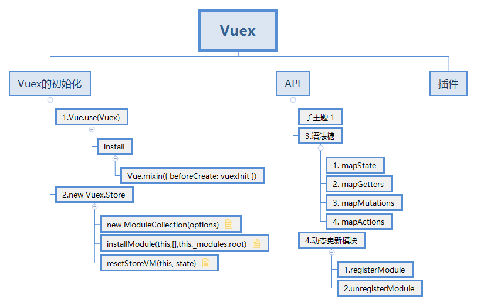

# 源码概览(Vuex3.x)

::: tip 前言
首先使用 Vue.use 加载 Vuex 混入 beforeCreate 代码，在 Vue 项目初始化时执行，然后实例化 Vuex，将实例以 store 的名称通过 Vue 初始化传入，初始化执行 beforeCreate 就可以在组件中拿到 vuex 实例
:::

## 1.实例化 Vuex.store

将用户的配置文件通过 new Vuex.store(options) 得到一个对象，以 store 值作为 vue 初始化实例的对象的一个值传入

## 2.加载 Vuex 插件

Vuex 是以插件的方式通过 Vue.use 加载的，当 Vue.use(Vuex)时,内部会调用 Vuex 这个类上面的 install 方法，通过 Vue.mixin 方法混入到 beforeCreate 这个生命周期中 this.store=this.$option.store

## 3.当加载组件的时候

执行生命周期函数会将之前实例化 Vuex.store 挂载到 this.store 上，用户可以使用 this.store.state、this.store.mutation

### 3.1 mapState

用户将 mapState 在 computed 中使用会返回一个对象，这个对象就是之前在 store 中写的配置，里面有各种 state，在 compute 中会转换成一个函数，返回值的 state 指向 store 中的 state，key 就是自己想要拿到的 key
